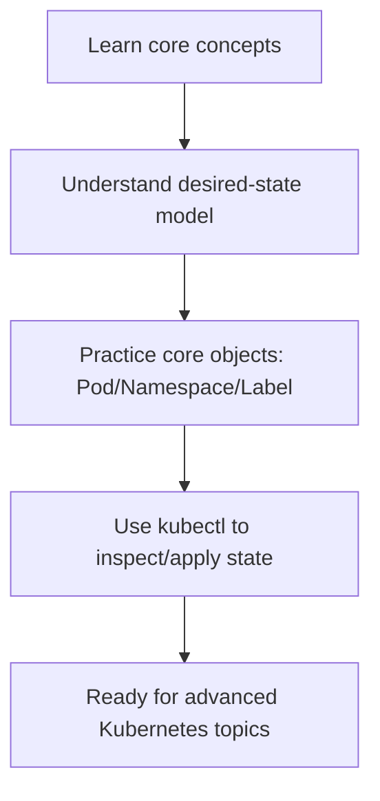
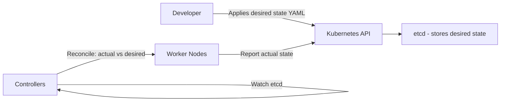
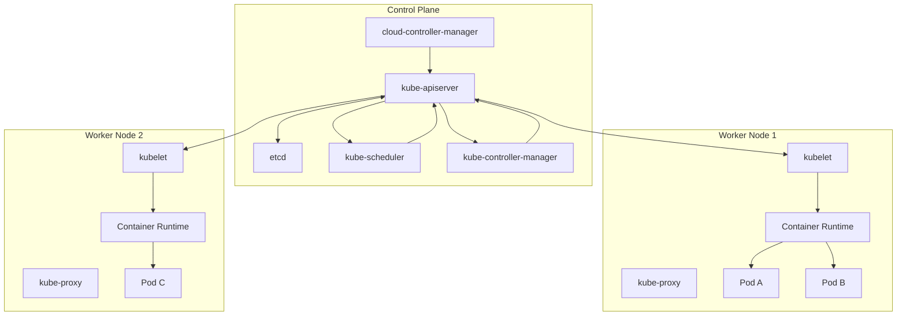
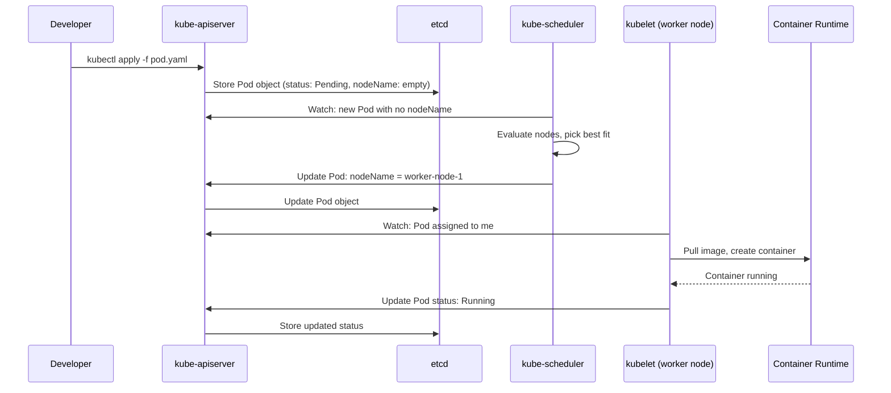
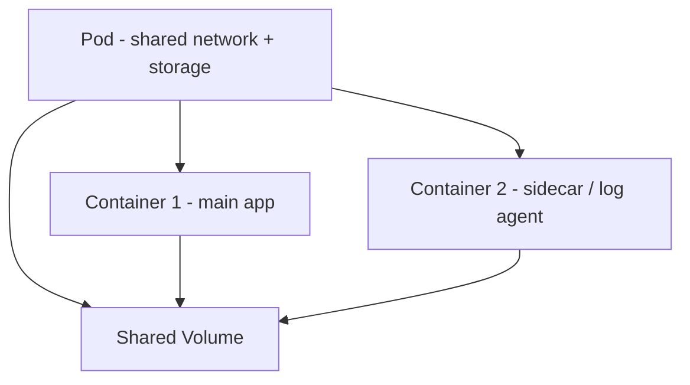
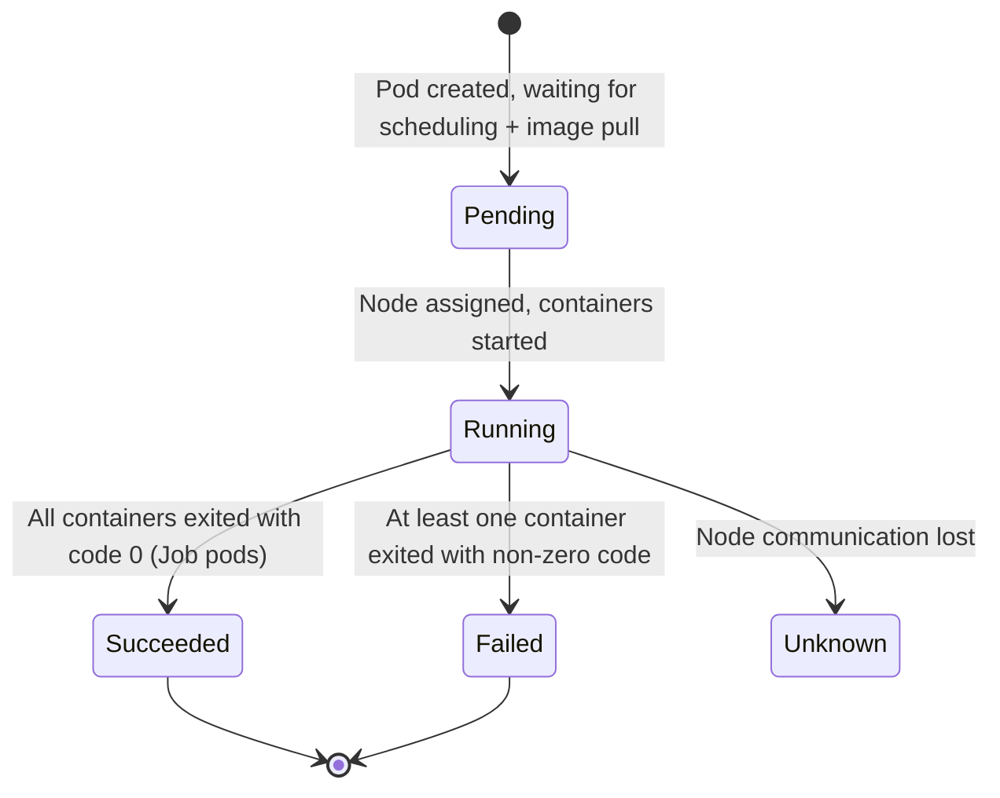
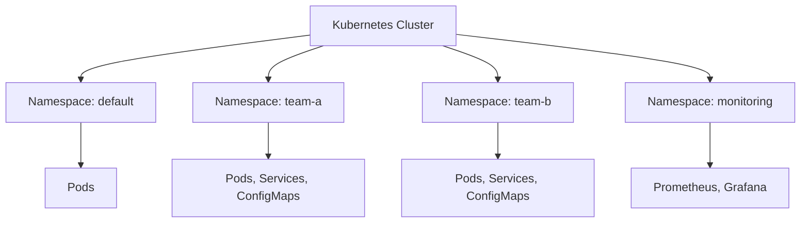
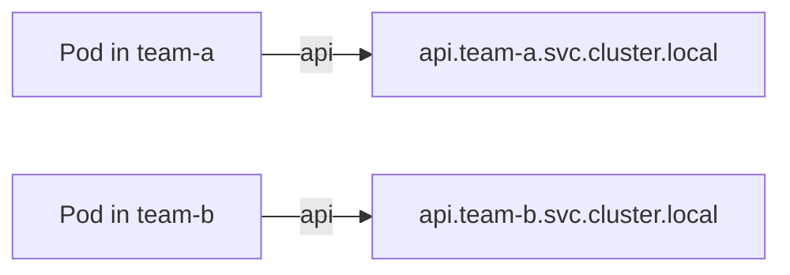
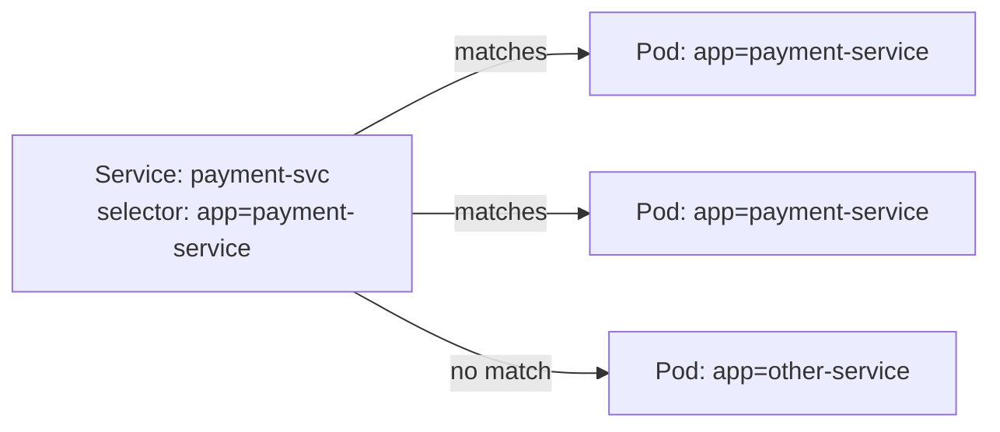
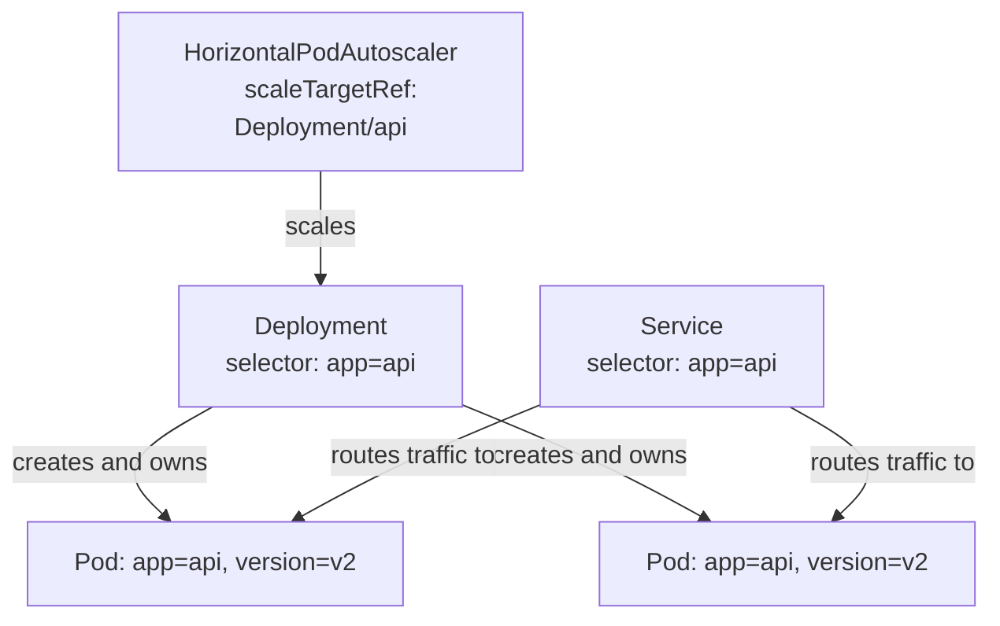

# Kubernetes Foundations

## What is it?
Kubernetes foundations cover the core concepts of the Kubernetes platform: cluster architecture, API-driven desired state, and primary objects like Pods, Namespaces, Labels, and Annotations.

## What is it used for?
- Learning how Kubernetes manages containerized workloads
- Understanding control plane and worker node responsibilities
- Building a strong base before workloads, networking, and security topics

## Why is it important?
Without strong fundamentals, advanced topics become confusing and operational decisions become risky.

## Workflow


## Topics Covered
1. What is Kubernetes?
2. Architecture Overview
3. kubectl Basics
4. Pods
5. Namespaces
6. Labels and Selectors
7. Annotations

---

## 1. What is Kubernetes?

### The Problem It Solves

Before Kubernetes, running containerised applications at scale meant manually managing where each container ran, restarting failed containers, handling networking between them, rolling out new versions, and scaling up under load. This was error-prone, slow, and hard to repeat across environments.

Kubernetes (K8s) is an open-source **container orchestration platform** that automates:
- **Scheduling** — deciding which node a container runs on
- **Self-healing** — restarting crashed containers, rescheduling on failed nodes
- **Scaling** — adding or removing instances automatically based on load
- **Deployment management** — rolling updates, rollbacks, canary releases
- **Service discovery and load balancing** — containers find each other by name, not IP
- **Configuration and secret management** — separating config from code
- **Storage orchestration** — attaching persistent storage dynamically

### What Kubernetes Is Not

| It is NOT | What to use instead |
|---|---|
| A container runtime | Docker, containerd, CRI-O handle that |
| A CI/CD system | Jenkins, GitHub Actions, Azure DevOps |
| A monitoring system | Prometheus, Grafana, Azure Monitor |
| A service mesh | Istio, Linkerd (those run *on top of* K8s) |

### Why "Kubernetes"?

The name comes from the Greek word for helmsman or pilot — the person who steers a ship. The logo is a ship's wheel. The abbreviation **K8s** comes from replacing the 8 middle letters of "Kubernetes" with the number 8.

### The Core Idea

You describe **desired state** in YAML manifests (e.g. "I want 3 replicas of this container running"). Kubernetes continuously works to make the **actual state** match that desired state. This is called the **reconciliation loop** — the foundation of how everything in K8s works.



---

## 2. Architecture Overview

### High-Level Split

A Kubernetes cluster has two types of machines:

| Component | Role |
|---|---|
| **Control Plane** | The brain — makes scheduling decisions, watches state, runs control loops |
| **Worker Nodes** | The muscle — actually run your containerised workloads (pods) |



---

### Control Plane Components

#### kube-apiserver
- The **front door** to the entire cluster
- All communication goes through it — kubectl, controllers, nodes, external tools
- Validates and processes REST requests
- The only component that reads from and writes to etcd
- Horizontally scalable — multiple API server instances can run behind a load balancer

#### etcd
- A **distributed key-value store** — the single source of truth for all cluster state
- Stores every object: pods, deployments, services, config maps, secrets, RBAC rules — everything
- Uses the **Raft consensus algorithm** for distributed consistency
- Critical: if etcd is lost and not backed up, the cluster state is gone
- Runs only on control plane nodes; typically 3 or 5 instances for high availability

#### kube-scheduler
- Watches for newly created pods that have no node assigned
- Evaluates all available nodes against the pod's requirements:
  - Resource requests (CPU/memory)
  - Node selectors, affinity/anti-affinity rules
  - Taints and tolerations
  - Available ports, volumes
- Picks the best node and writes the assignment back to the API server
- Does not actually start the pod — kubelet does that

#### kube-controller-manager
- Runs a collection of **control loops** (controllers), each watching and reconciling one type of object
- Key controllers inside it:
  - **Node controller** — detects and responds to node failures
  - **ReplicaSet controller** — ensures the correct number of pod replicas are running
  - **Deployment controller** — manages rolling updates and rollbacks
  - **Job controller** — tracks job completion
  - **Service Account controller** — creates default service accounts in new namespaces

#### cloud-controller-manager
- Bridges Kubernetes and the underlying cloud provider (Azure, AWS, GCP)
- Handles cloud-specific tasks: provisioning load balancers, attaching persistent disks, syncing node status with cloud VM state
- In AKS this is managed for you

---

### Worker Node Components

#### kubelet
- Runs on every worker node
- Receives **PodSpecs** from the API server and ensures the described containers are running and healthy
- Communicates with the container runtime (via CRI) to start/stop containers
- Reports node and pod status back to the API server
- Runs liveness and readiness probes and restarts containers if they fail

#### kube-proxy
- Runs on every node
- Maintains **network rules** (iptables or IPVS) that enable communication to Services
- When a request arrives for a Service's ClusterIP, kube-proxy routes it to one of the backing pods
- Does not handle pod-to-pod networking directly — that is the CNI plugin's job

#### Container Runtime
- The software that actually runs containers on a node
- Kubernetes uses the **Container Runtime Interface (CRI)** to talk to the runtime — the runtime itself is pluggable
- Common runtimes: **containerd** (default in most distributions), **CRI-O**
- Docker is no longer a supported runtime directly (containerd handles that layer)

---

### How a Pod Gets Scheduled — End to End



---

## 3. kubectl Basics

`kubectl` is the command-line tool for interacting with a Kubernetes cluster. It communicates with the API server.

### kubeconfig — How kubectl Knows Which Cluster

kubectl reads its configuration from `~/.kube/config` (or the path in `KUBECONFIG` env var). This file defines:

| Concept | Meaning |
|---|---|
| **Cluster** | API server URL + certificate authority |
| **User** | Credentials (certificate, token, or exec plugin) |
| **Context** | A named pairing of cluster + user + default namespace |
| **Current context** | The active context kubectl uses by default |

```bash
# View your full kubeconfig
kubectl config view

# List all contexts
kubectl config get-contexts

# Switch active context
kubectl config use-context <context-name>

# Show current context
kubectl config current-context

# Set default namespace for current context
kubectl config set-context --current --namespace=<namespace>
```

---

### Core Read Commands

```bash
# List resources
kubectl get pods
kubectl get pods -n <namespace>
kubectl get pods --all-namespaces
kubectl get pods -o wide          # shows node, IP
kubectl get pods -o yaml          # full object as YAML
kubectl get pods -o json          # full object as JSON

# Describe: human-readable detail including events
kubectl describe pod <pod-name>
kubectl describe node <node-name>
kubectl describe service <svc-name>

# Get all resource types at once
kubectl get all -n <namespace>
```

---

### Logs

```bash
# Logs from a single-container pod
kubectl logs <pod-name>

# Follow (stream) logs
kubectl logs -f <pod-name>

# Logs from a specific container in a multi-container pod
kubectl logs <pod-name> -c <container-name>

# Logs from the previous (crashed) instance of a container
kubectl logs <pod-name> --previous

# Last N lines
kubectl logs <pod-name> --tail=100
```

---

### Exec Into a Running Container

```bash
# Interactive shell inside a pod
kubectl exec -it <pod-name> -- /bin/bash
# or if bash is not available
kubectl exec -it <pod-name> -- /bin/sh

# Run a single command without interactive session
kubectl exec <pod-name> -- env
kubectl exec <pod-name> -- cat /etc/config/app.conf

# Specify container in multi-container pod
kubectl exec -it <pod-name> -c <container-name> -- /bin/bash
```

---

### Apply, Delete, Edit

```bash
# Apply a manifest (create or update)
kubectl apply -f pod.yaml
kubectl apply -f ./directory/          # apply all YAML in a directory

# Delete a resource
kubectl delete pod <pod-name>
kubectl delete -f pod.yaml             # delete what the manifest describes

# Edit a live object in your default editor
kubectl edit deployment <name>

# Patch a field without editing the whole object
kubectl patch deployment <name> -p '{"spec":{"replicas":3}}'
```

---

### Useful Flags

| Flag | Effect |
|---|---|
| `-n <namespace>` | Target a specific namespace |
| `--all-namespaces` / `-A` | Across all namespaces |
| `-o wide` | Extra columns (node, IP) |
| `-o yaml` | Full YAML representation |
| `-o jsonpath=...` | Extract specific fields |
| `--watch` / `-w` | Watch for changes |
| `--dry-run=client` | Validate without applying |
| `-l <label=value>` | Filter by label selector |

---

### Port Forwarding (Local Testing)

```bash
# Forward local port 8080 to port 80 on a pod
kubectl port-forward pod/<pod-name> 8080:80

# Forward to a service
kubectl port-forward service/<svc-name> 8080:80
```

---

## 4. Pods

### What Is a Pod?

A **Pod** is the smallest deployable unit in Kubernetes. A pod wraps one or more containers that:
- Share the same **network namespace** — same IP address, same port space
- Share the same **IPC namespace** — can communicate via shared memory
- Can share **volumes** mounted into multiple containers

A pod is not a container — it is the environment that containers run inside.



---

### Pod Lifecycle



| Phase | Meaning |
|---|---|
| `Pending` | Accepted by cluster but not yet running — scheduling or image pull in progress |
| `Running` | Pod bound to a node; at least one container is running |
| `Succeeded` | All containers have exited successfully — common in Jobs |
| `Failed` | All containers have exited; at least one failed |
| `Unknown` | State cannot be determined — usually a node communication problem |

---

### Container States Within a Pod

Even when a Pod is `Running`, individual containers have their own states:

| State | Meaning |
|---|---|
| `Waiting` | Not yet running — pulling image, initialising |
| `Running` | Executing normally |
| `Terminated` | Exited — check `exitCode` and `reason` |

Common `reason` values seen in `kubectl describe pod`:
- `CrashLoopBackOff` — container keeps crashing; K8s backs off before restarting
- `OOMKilled` — container exceeded its memory limit and was killed
- `ImagePullBackOff` — cannot pull the container image
- `Error` — container exited with a non-zero exit code

---

### Minimal Pod Manifest

```yaml
apiVersion: v1
kind: Pod
metadata:
  name: my-app
  namespace: default
  labels:
    app: my-app
    env: dev
spec:
  containers:
    - name: main
      image: nginx:1.25
      ports:
        - containerPort: 80
      resources:
        requests:
          cpu: "100m"
          memory: "128Mi"
        limits:
          cpu: "500m"
          memory: "256Mi"
```

---

### Restart Policies

| Policy | Behaviour |
|---|---|
| `Always` (default) | Always restart the container when it exits — for long-running services |
| `OnFailure` | Restart only if exit code is non-zero — for Jobs |
| `Never` | Never restart — run once and done |

---

### Multi-Container Pods

Multiple containers in a pod share network and can share volumes. Common patterns:

#### Sidecar
A helper container runs alongside the main app — e.g. a log shipper, metrics exporter, or config reloader.

```yaml
spec:
  containers:
    - name: app
      image: my-app:1.0
    - name: log-shipper
      image: fluent/fluent-bit:latest
      volumeMounts:
        - name: app-logs
          mountPath: /var/log/app
  volumes:
    - name: app-logs
      emptyDir: {}
```

#### Ambassador
A proxy container that handles all outbound network calls for the main app — e.g. Envoy sidecar for service mesh.

#### Adapter
A container that transforms or normalises the main container's output — e.g. reformatting logs or metrics into a standard format.

---

### Init Containers

Init containers run **before** the main containers start. They must complete successfully before any main container is started. Use cases:
- Wait for a dependency to become ready (database, service)
- Seed a volume with config files
- Run database migrations before the app starts

```yaml
spec:
  initContainers:
    - name: wait-for-db
      image: busybox
      command: ['sh', '-c', 'until nc -z db-service 5432; do echo waiting; sleep 2; done']
  containers:
    - name: app
      image: my-app:1.0
```

Properties of init containers:
- Run sequentially — each must succeed before the next starts
- If an init container fails, the pod restarts (based on `restartPolicy`)
- They run to completion — unlike main containers, they are not kept alive
- They have the same volume/network access as main containers

---

### Probes (Health Checks)

Kubernetes uses three types of probes to check container health:

| Probe | Triggers | Effect on failure |
|---|---|---|
| `livenessProbe` | Is the container still alive? | Container is restarted |
| `readinessProbe` | Is the container ready to receive traffic? | Pod removed from Service endpoint — no traffic sent |
| `startupProbe` | Has the container finished starting up? | Liveness/readiness probes disabled until this passes |

```yaml
containers:
  - name: app
    image: my-app:1.0
    livenessProbe:
      httpGet:
        path: /healthz
        port: 8080
      initialDelaySeconds: 10
      periodSeconds: 15
    readinessProbe:
      httpGet:
        path: /ready
        port: 8080
      initialDelaySeconds: 5
      periodSeconds: 10
```

---

## 5. Namespaces

### What Is a Namespace?

A **namespace** is a logical partition inside a single Kubernetes cluster. It lets multiple teams, applications, or environments share the same cluster without interfering with each other.



---

### Default Namespaces

| Namespace | Purpose |
|---|---|
| `default` | Where objects go if no namespace is specified |
| `kube-system` | Kubernetes internal components (CoreDNS, kube-proxy, metrics-server) |
| `kube-public` | Publicly readable — contains a `cluster-info` ConfigMap |
| `kube-node-lease` | Holds node heartbeat lease objects |

Never put your application workloads in `kube-system`.

---

### What Namespaces Scope

Most Kubernetes objects are **namespace-scoped**:
- Pods, Deployments, Services, ConfigMaps, Secrets, ServiceAccounts, RoleBindings

Some objects are **cluster-scoped** (not in any namespace):
- Nodes, PersistentVolumes, StorageClasses, ClusterRoles, ClusterRoleBindings, Namespaces themselves

---

### Creating and Using Namespaces

```bash
# Create a namespace
kubectl create namespace team-a

# Or via manifest
kubectl apply -f - <<EOF
apiVersion: v1
kind: Namespace
metadata:
  name: team-a
  labels:
    team: a
    env: prod
EOF

# List all namespaces
kubectl get namespaces

# Run commands in a specific namespace
kubectl get pods -n team-a
kubectl apply -f app.yaml -n team-a

# Set default namespace for current context
kubectl config set-context --current --namespace=team-a
```

---

### Resource Quotas

Namespaces can be given resource limits to prevent one team consuming all cluster resources:

```yaml
apiVersion: v1
kind: ResourceQuota
metadata:
  name: team-a-quota
  namespace: team-a
spec:
  hard:
    pods: "20"
    requests.cpu: "4"
    requests.memory: 8Gi
    limits.cpu: "8"
    limits.memory: 16Gi
    services: "10"
    persistentvolumeclaims: "5"
```

---

### LimitRange

Sets default and maximum resource requests/limits for objects in a namespace:

```yaml
apiVersion: v1
kind: LimitRange
metadata:
  name: default-limits
  namespace: team-a
spec:
  limits:
    - type: Container
      default:
        cpu: "200m"
        memory: "256Mi"
      defaultRequest:
        cpu: "100m"
        memory: "128Mi"
      max:
        cpu: "2"
        memory: "2Gi"
```

---

### DNS and Namespace Isolation

Each service in a namespace is reachable:
- **Within same namespace:** `service-name` (short name)
- **Cross-namespace:** `service-name.namespace.svc.cluster.local` (FQDN)

This means two teams can each have a service named `api` — they do not conflict because they live in different namespaces.



---

## 6. Labels and Selectors

### What Are Labels?

**Labels** are key-value pairs attached to any Kubernetes object. They are the primary way Kubernetes objects identify and find each other.

```yaml
metadata:
  labels:
    app: payment-service
    version: v2
    env: production
    team: payments
```

Labels are **arbitrary** — there is no enforced schema. The convention is to use consistent, meaningful keys across your organisation.

---

### Common Label Conventions

The `app.kubernetes.io/` prefix is recommended for well-known labels:

| Label | Purpose |
|---|---|
| `app.kubernetes.io/name` | Name of the application |
| `app.kubernetes.io/version` | Version of the application |
| `app.kubernetes.io/component` | Component role (frontend, backend, database) |
| `app.kubernetes.io/part-of` | Higher-level app this belongs to |
| `app.kubernetes.io/managed-by` | Tool managing this resource (helm, kustomize) |

---

### Selectors — How Objects Find Each Other

A **selector** is a query against labels. It finds all objects matching the specified labels.

#### Equality-based selector
```yaml
selector:
  matchLabels:
    app: payment-service
    env: production
```
Matches objects where `app=payment-service` AND `env=production`.

#### Set-based selector
```yaml
selector:
  matchExpressions:
    - key: env
      operator: In
      values: [production, staging]
    - key: version
      operator: NotIn
      values: [v1]
    - key: debug
      operator: DoesNotExist
```

Operators: `In`, `NotIn`, `Exists`, `DoesNotExist`

---

### How Services Use Selectors

A Service uses a selector to decide which pods receive its traffic:

```yaml
apiVersion: v1
kind: Service
metadata:
  name: payment-svc
spec:
  selector:
    app: payment-service      # routes to ALL pods with this label
  ports:
    - port: 80
      targetPort: 8080
```



---

### How Deployments Use Selectors

A Deployment's `selector` determines which pods it owns and manages:

```yaml
apiVersion: apps/v1
kind: Deployment
metadata:
  name: payment-deployment
spec:
  selector:
    matchLabels:
      app: payment-service
  template:
    metadata:
      labels:
        app: payment-service    # pods created MUST match selector
    spec:
      containers:
        - name: payment
          image: payment:v2
```

The `selector` in a Deployment is **immutable after creation** — you cannot change it without deleting and recreating the deployment.

---

### Querying by Labels with kubectl

```bash
# Filter resources by label
kubectl get pods -l app=payment-service
kubectl get pods -l app=payment-service,env=production

# Set-based filter
kubectl get pods -l 'env in (production, staging)'
kubectl get pods -l 'version notin (v1)'

# Show labels on resources
kubectl get pods --show-labels

# Add a label to an existing object
kubectl label pod <pod-name> debug=true

# Remove a label
kubectl label pod <pod-name> debug-
```

---

### Label Selector in Practice — End to End



---

## 7. Annotations

### What Are Annotations?

**Annotations** are also key-value pairs on Kubernetes objects, but unlike labels:
- They are **not used for selection** — no selector can match on annotations
- They are meant for **metadata consumed by tools, operators, and humans**
- Values can be **large and unstructured** — JSON, URLs, multi-line text, counters

```yaml
metadata:
  annotations:
    deployment.kubernetes.io/revision: "3"
    kubectl.kubernetes.io/last-applied-configuration: |
      {"apiVersion":"v1",...}
    prometheus.io/scrape: "true"
    prometheus.io/port: "9090"
    owner: "team-payments"
    runbook: "https://wiki.example.com/runbooks/payment-service"
```

---

### Labels vs Annotations

| Dimension | Labels | Annotations |
|---|---|---|
| Used for selection | ✅ Yes | ❌ No |
| Used for grouping / filtering | ✅ Yes | ❌ No |
| Value constraints | Short, simple strings | Any string — including large JSON blobs |
| Read by Kubernetes internals | ✅ Often | Rarely (some system annotations exist) |
| Read by external tools | Sometimes | Very commonly |
| Example use | Identify which pods a Service targets | Tell Prometheus to scrape this pod |

---

### Common Annotation Use Cases

| Annotation | Who uses it | Purpose |
|---|---|---|
| `kubectl.kubernetes.io/last-applied-configuration` | kubectl | Stores last-applied state for 3-way diff on next apply |
| `deployment.kubernetes.io/revision` | Deployment controller | Tracks rollout revision number |
| `prometheus.io/scrape: "true"` | Prometheus | Opt pod in for metrics scraping |
| `prometheus.io/path: /metrics` | Prometheus | Custom metrics path |
| `cluster-autoscaler.kubernetes.io/safe-to-evict: "false"` | Cluster Autoscaler | Prevent this pod from being evicted during scale-down |
| `kubernetes.io/ingress.class` | Ingress controllers | Which ingress controller handles this Ingress |
| `cert-manager.io/cluster-issuer` | cert-manager | Which cert issuer to use for TLS |
| `sidecar.istio.io/inject: "false"` | Istio | Opt out of automatic sidecar injection |

---

### Working with Annotations via kubectl

```bash
# Add an annotation
kubectl annotate pod <pod-name> owner="team-payments"

# Update an existing annotation (--overwrite required)
kubectl annotate pod <pod-name> owner="team-infra" --overwrite

# Remove an annotation
kubectl annotate pod <pod-name> owner-

# View annotations
kubectl describe pod <pod-name>       # shows in Annotations section
kubectl get pod <pod-name> -o yaml    # shows under metadata.annotations
```

---

## Putting It All Together

Here is a complete minimal application using all concepts from Stage 1:

```yaml
# namespace.yaml
apiVersion: v1
kind: Namespace
metadata:
  name: myapp
  labels:
    team: platform

---
# pod.yaml
apiVersion: v1
kind: Pod
metadata:
  name: web
  namespace: myapp
  labels:
    app: web
    version: v1
    env: dev
  annotations:
    owner: "team-platform"
    prometheus.io/scrape: "true"
    prometheus.io/port: "8080"
spec:
  initContainers:
    - name: check-config
      image: busybox
      command: ['sh', '-c', 'echo Config OK']
  containers:
    - name: nginx
      image: nginx:1.25
      ports:
        - containerPort: 80
      resources:
        requests:
          cpu: "100m"
          memory: "128Mi"
        limits:
          cpu: "500m"
          memory: "256Mi"
      livenessProbe:
        httpGet:
          path: /
          port: 80
        initialDelaySeconds: 5
        periodSeconds: 10
      readinessProbe:
        httpGet:
          path: /
          port: 80
        initialDelaySeconds: 3
        periodSeconds: 5
    - name: log-sidecar
      image: busybox
      command: ['sh', '-c', 'tail -f /dev/null']
```

Deploy and explore:
```bash
kubectl apply -f namespace.yaml
kubectl apply -f pod.yaml

# Watch pod come up
kubectl get pods -n myapp -w

# Observe init container then main containers
kubectl describe pod web -n myapp

# Exec into main container
kubectl exec -it web -n myapp -c nginx -- /bin/sh

# Filter by label
kubectl get pods -n myapp -l app=web --show-labels

# View annotations
kubectl get pod web -n myapp -o jsonpath='{.metadata.annotations}'
```

---

## Quick Reference

### kubectl Cheat Sheet

```bash
# Cluster info
kubectl cluster-info
kubectl get nodes -o wide

# Contexts
kubectl config get-contexts
kubectl config use-context <name>

# Namespace shortcut
kubectl get pods -n kube-system

# Pod debugging
kubectl describe pod <name>
kubectl logs <name> --previous
kubectl exec -it <name> -- /bin/sh

# Labels
kubectl get pods -l app=web --show-labels
kubectl label pod <name> key=value

# Annotations
kubectl annotate pod <name> key=value

# Dry run (validate without applying)
kubectl apply -f manifest.yaml --dry-run=client
```

### Pod Lifecycle at a Glance

```
kubectl apply → Pending (scheduling) → Init containers → Running → Succeeded / Failed
                                          ↕ CrashLoopBackOff if init fails
```

### Namespace DNS Pattern
```
<service>.<namespace>.svc.cluster.local
```

---

## Summary

| Topic | Core idea |
|---|---|
| Kubernetes | Automates container scheduling, healing, scaling via desired-state reconciliation |
| Architecture | Control plane (API server, etcd, scheduler, controller-manager) + worker nodes (kubelet, kube-proxy, runtime) |
| kubectl | CLI to the API server — get, describe, logs, exec, apply, delete |
| Pods | Smallest unit; wraps containers sharing network+storage; has lifecycle phases and health probes |
| Namespaces | Logical isolation within a cluster; scope for RBAC, quotas, DNS |
| Labels | Key-value pairs used for selection — how Services find pods, how Deployments own pods |
| Annotations | Key-value metadata for tooling — not used for selection; stores operational and config metadata |
