# Kubernetes Core Workloads

## What is it?
Core workloads are Kubernetes controllers and resources used to run applications reliably: `Deployment`, `StatefulSet`, `DaemonSet`, `Job`, and autoscalers.

## What is it used for?
- Running stateless and stateful services
- Managing rollouts, restarts, and replica counts
- Executing one-time and scheduled tasks

## Why is it important?
Choosing the right workload controller is critical for reliability, scaling, and correct runtime behavior.

## Workflow
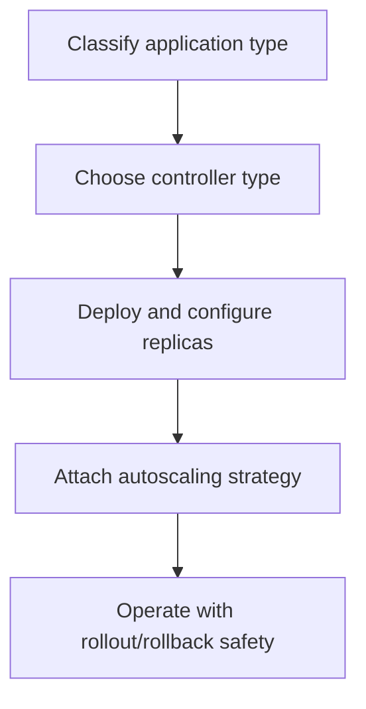

## Topics Covered
8. ReplicaSets
9. Deployments
10. StatefulSets
11. DaemonSets
12. Jobs and CronJobs
13. Horizontal Pod Autoscaler (HPA)
14. Vertical Pod Autoscaler (VPA)

---

## 8. ReplicaSets

### What Is a ReplicaSet?

A **ReplicaSet** ensures that a specified number of identical pod replicas are running at all times. If a pod crashes or is deleted, the ReplicaSet controller creates a new one. If there are too many pods, it deletes the excess.

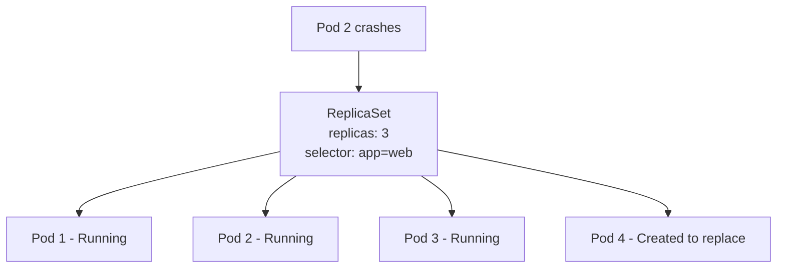

### How It Works

The ReplicaSet controller continuously watches the cluster. Its reconciliation loop:
1. Count pods matching the selector
2. If count < desired → create new pods
3. If count > desired → delete excess pods

### ReplicaSet Manifest

```yaml
apiVersion: apps/v1
kind: ReplicaSet
metadata:
  name: web-rs
  namespace: default
spec:
  replicas: 3
  selector:
    matchLabels:
      app: web
  template:
    metadata:
      labels:
        app: web       # MUST match selector above
    spec:
      containers:
        - name: nginx
          image: nginx:1.25
          ports:
            - containerPort: 80
          resources:
            requests:
              cpu: "100m"
              memory: "128Mi"
            limits:
              cpu: "500m"
              memory: "256Mi"
```

### Key Rules

- The pod template's labels **must match** the selector — the API server enforces this
- A ReplicaSet **adopts** any existing pods that match its selector — even if it didn't create them
- Deleting a ReplicaSet deletes all its pods by default (`--cascade=foreground`)
- You can delete a ReplicaSet without deleting its pods: `kubectl delete rs <name> --cascade=orphan`

### ReplicaSet vs Deployment

| | ReplicaSet | Deployment |
|---|---|---|
| Manages pods | ✅ | ✅ (via a ReplicaSet it owns) |
| Rolling updates | ❌ | ✅ |
| Rollback | ❌ | ✅ |
| Revision history | ❌ | ✅ |
| Use directly? | Rarely | Always preferred |

> In practice, you almost never create ReplicaSets directly. You create Deployments, which create and manage ReplicaSets for you.

### kubectl Commands

```bash
kubectl get replicasets
kubectl get rs                            # shorthand
kubectl describe rs web-rs
kubectl scale rs web-rs --replicas=5
kubectl delete rs web-rs
```

---

## 9. Deployments

### What Is a Deployment?

A **Deployment** is the standard way to run stateless applications in Kubernetes. It manages a ReplicaSet and adds:
- **Rolling updates** — gradually replace old pods with new ones
- **Rollback** — revert to a previous version instantly
- **Revision history** — track every change
- **Pause and resume** — hold an in-progress rollout

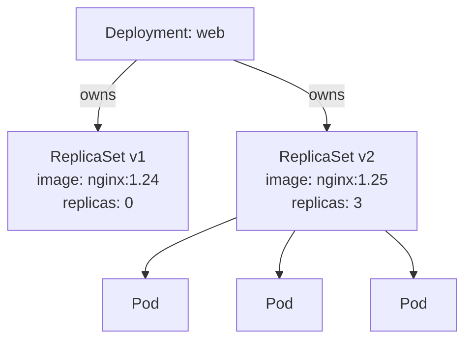

### Deployment Manifest

```yaml
apiVersion: apps/v1
kind: Deployment
metadata:
  name: web
  namespace: default
  labels:
    app: web
spec:
  replicas: 3
  selector:
    matchLabels:
      app: web
  strategy:
    type: RollingUpdate
    rollingUpdate:
      maxSurge: 1          # max pods above desired during update
      maxUnavailable: 1    # max pods below desired during update
  revisionHistoryLimit: 5  # how many old ReplicaSets to keep
  template:
    metadata:
      labels:
        app: web
    spec:
      containers:
        - name: nginx
          image: nginx:1.25
          ports:
            - containerPort: 80
          readinessProbe:
            httpGet:
              path: /
              port: 80
            initialDelaySeconds: 5
            periodSeconds: 5
          resources:
            requests:
              cpu: "100m"
              memory: "128Mi"
            limits:
              cpu: "500m"
              memory: "256Mi"
```

---

### Rolling Update Strategy

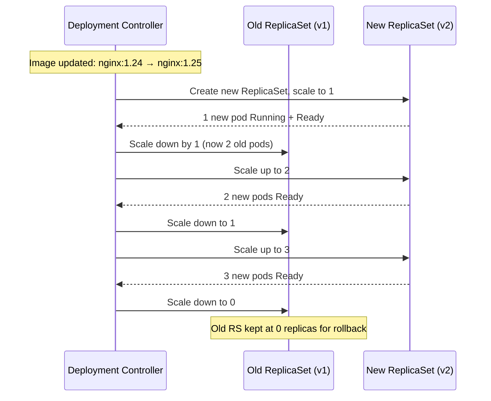

The readiness probe gates each step — a new pod must be ready before the old one is removed.

### Update Strategies

| Strategy | Behaviour | Use case |
|---|---|---|
| `RollingUpdate` (default) | Gradually replace pods — no downtime | Stateless services |
| `Recreate` | Kill all old pods, then create new ones — brief downtime | Apps that cannot run two versions simultaneously |

---

### Rollout Commands

```bash
# Apply an update
kubectl apply -f deployment.yaml

# Watch rollout progress
kubectl rollout status deployment/web

# View rollout history
kubectl rollout history deployment/web

# View details of a specific revision
kubectl rollout history deployment/web --revision=2

# Rollback to previous version
kubectl rollout undo deployment/web

# Rollback to a specific revision
kubectl rollout undo deployment/web --to-revision=2

# Pause a rollout mid-way
kubectl rollout pause deployment/web

# Resume a paused rollout
kubectl rollout resume deployment/web

# Force a restart without changing the image (e.g. to pick up new ConfigMap)
kubectl rollout restart deployment/web
```

---

### Scaling

```bash
# Manual scale
kubectl scale deployment web --replicas=5

# Autoscale (creates an HPA — see section 13)
kubectl autoscale deployment web --min=2 --max=10 --cpu-percent=70
```

---

### Deployment Lifecycle

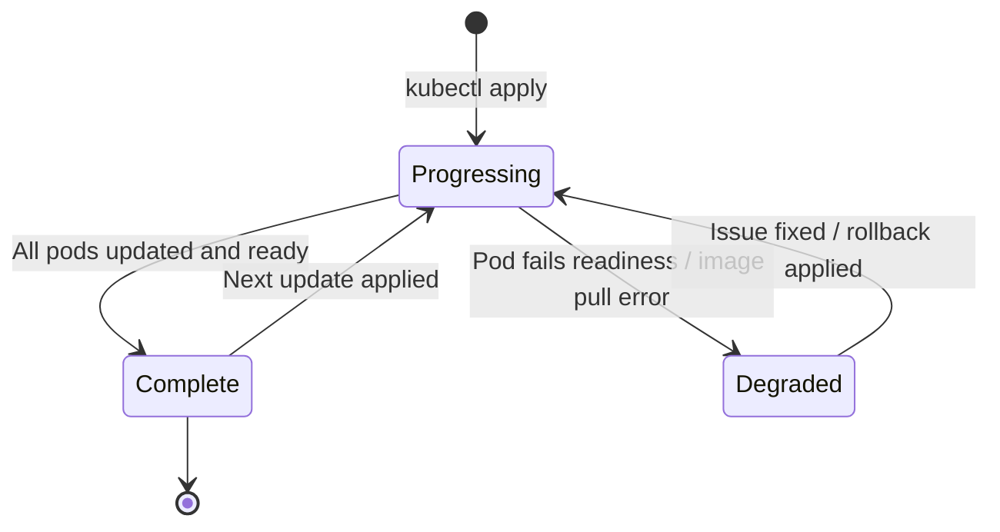

---

## 10. StatefulSets

### What Is a StatefulSet?

A **StatefulSet** manages pods that need:
- A **stable, unique identity** (pod name is predictable and persists across restarts)
- **Stable, persistent storage** (each pod gets its own PersistentVolumeClaim)
- **Ordered deployment and scaling** (pods created/deleted in order)

Used for: databases (MySQL, PostgreSQL, MongoDB, Cassandra), message brokers (Kafka, RabbitMQ), distributed caches (Redis Cluster), and any stateful application where pod identity matters.

### Stable Pod Names

StatefulSet pods are named `<statefulset-name>-<ordinal>`:

```
web-0
web-1
web-2
```

Unlike Deployment pods (which get random suffixes like `web-7d9f4b-xkz2p`), these names are fixed. If `web-1` is deleted, the replacement is always named `web-1` on the same node or a new node, and picks up the same PVC.

### Stable Network Identity

Each pod gets a DNS hostname via a **Headless Service**:

```
web-0.web-svc.default.svc.cluster.local
web-1.web-svc.default.svc.cluster.local
```

This allows pods to address each other directly — required by databases for cluster membership and replication.

### StatefulSet Manifest

```yaml
apiVersion: apps/v1
kind: StatefulSet
metadata:
  name: postgres
  namespace: default
spec:
  serviceName: "postgres-headless"   # must match the headless service name
  replicas: 3
  selector:
    matchLabels:
      app: postgres
  template:
    metadata:
      labels:
        app: postgres
    spec:
      containers:
        - name: postgres
          image: postgres:15
          ports:
            - containerPort: 5432
          env:
            - name: POSTGRES_PASSWORD
              valueFrom:
                secretKeyRef:
                  name: postgres-secret
                  key: password
          volumeMounts:
            - name: data
              mountPath: /var/lib/postgresql/data
          resources:
            requests:
              cpu: "250m"
              memory: "512Mi"
            limits:
              cpu: "1"
              memory: "1Gi"
  volumeClaimTemplates:               # each pod gets its own PVC
    - metadata:
        name: data
      spec:
        accessModes: ["ReadWriteOnce"]
        storageClassName: "managed-premium"
        resources:
          requests:
            storage: 20Gi
---
apiVersion: v1
kind: Service
metadata:
  name: postgres-headless
  namespace: default
spec:
  clusterIP: None          # headless — no load balancing, direct pod DNS
  selector:
    app: postgres
  ports:
    - port: 5432
```

### Ordering Behaviour

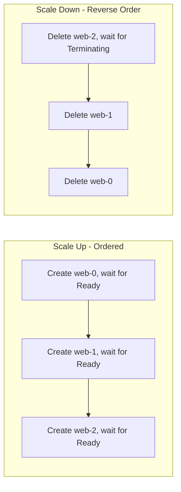

| Behaviour | StatefulSet | Deployment |
|---|---|---|
| Pod names | Stable, ordinal | Random suffix |
| Pod DNS | Per-pod hostname | Not applicable |
| Storage | Per-pod PVC (persists) | Shared or no persistent storage |
| Scale up order | One at a time (0 → N) | All at once |
| Scale down order | Reverse (N → 0) | Arbitrary |
| Update strategy | `RollingUpdate` (reverse order) or `OnDelete` | `RollingUpdate` or `Recreate` |

### PVC Lifecycle Note

Deleting a StatefulSet does **not** delete its PVCs. This is intentional — data is preserved. You must delete PVCs manually:

```bash
kubectl delete statefulset postgres
kubectl delete pvc -l app=postgres   # separate step
```

---

## 11. DaemonSets

### What Is a DaemonSet?

A **DaemonSet** ensures that **one copy of a pod runs on every node** (or a subset of nodes). When a new node joins the cluster, the DaemonSet controller automatically schedules the pod on it. When a node is removed, the pod is garbage collected.

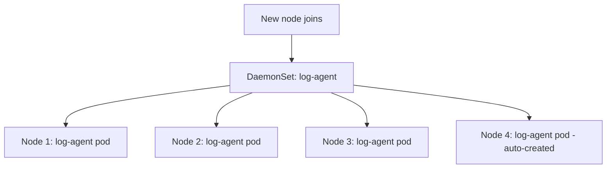

### Common Use Cases

| Use case | Example |
|---|---|
| Log collection | Fluent Bit, Fluentd — one agent per node ships logs to a central store |
| Metrics collection | Prometheus Node Exporter — collects OS-level metrics per node |
| Network plugin | CNI plugins (Calico, Cilium) run as DaemonSets |
| Security agent | Falco, Sysdig — per-node runtime security monitoring |
| Storage driver | CSI node plugins run as DaemonSets |
| Service mesh proxy | Linkerd proxy injector components |

### DaemonSet Manifest

```yaml
apiVersion: apps/v1
kind: DaemonSet
metadata:
  name: log-agent
  namespace: kube-system
spec:
  selector:
    matchLabels:
      app: log-agent
  updateStrategy:
    type: RollingUpdate
    rollingUpdate:
      maxUnavailable: 1
  template:
    metadata:
      labels:
        app: log-agent
    spec:
      tolerations:
        - key: node-role.kubernetes.io/control-plane
          operator: Exists
          effect: NoSchedule             # run on control plane nodes too
      containers:
        - name: fluent-bit
          image: fluent/fluent-bit:2.1
          resources:
            requests:
              cpu: "50m"
              memory: "64Mi"
            limits:
              cpu: "200m"
              memory: "256Mi"
          volumeMounts:
            - name: varlog
              mountPath: /var/log
      volumes:
        - name: varlog
          hostPath:
            path: /var/log
```

### Running on a Subset of Nodes

Use `nodeSelector` or `nodeAffinity` to limit which nodes get the DaemonSet pod:

```yaml
spec:
  template:
    spec:
      nodeSelector:
        monitoring: "true"    # only nodes with this label get the pod
```

### Update Strategy

| Strategy | Behaviour |
|---|---|
| `RollingUpdate` (default) | Replaces pods on nodes one at a time |
| `OnDelete` | Only replaces a pod when you manually delete it — useful for careful rollouts |

---

## 12. Jobs and CronJobs

### Jobs

A **Job** creates one or more pods and ensures they run to **successful completion**. Unlike Deployments (which run pods indefinitely), a Job runs pods until the task is done.

Use cases: database migrations, batch processing, data exports, one-time setup scripts.

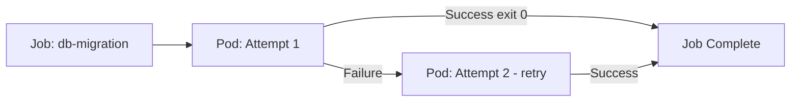

#### Job Manifest

```yaml
apiVersion: batch/v1
kind: Job
metadata:
  name: db-migration
  namespace: default
spec:
  completions: 1          # number of pods that must succeed
  parallelism: 1          # number of pods running at the same time
  backoffLimit: 3         # max retries before Job is marked Failed
  activeDeadlineSeconds: 300   # job must finish within 5 minutes
  ttlSecondsAfterFinished: 600 # auto-delete job 10 min after completion
  template:
    spec:
      restartPolicy: OnFailure   # Never or OnFailure — not Always
      containers:
        - name: migration
          image: my-app:v2
          command: ["python", "manage.py", "migrate"]
          resources:
            requests:
              cpu: "200m"
              memory: "256Mi"
```

#### Parallel Jobs

```yaml
spec:
  completions: 10    # need 10 successful completions total
  parallelism: 3     # run 3 pods at a time
```

This processes a queue in parallel — useful for batch workloads where each pod handles one item.

#### Job Completion Modes

| Mode | Behaviour |
|---|---|
| `NonIndexed` (default) | Any pod succeeding counts toward completion |
| `Indexed` | Each pod gets a unique index (`JOB_COMPLETION_INDEX` env var) — useful for partitioned work |

---

### CronJobs

A **CronJob** creates Jobs on a schedule using standard cron syntax.

```yaml
apiVersion: batch/v1
kind: CronJob
metadata:
  name: nightly-report
  namespace: default
spec:
  schedule: "0 2 * * *"         # 2:00 AM every day
  timeZone: "UTC"
  concurrencyPolicy: Forbid     # don't start new job if previous still running
  successfulJobsHistoryLimit: 3
  failedJobsHistoryLimit: 1
  startingDeadlineSeconds: 60   # if missed, only try within 60s of scheduled time
  jobTemplate:
    spec:
      backoffLimit: 2
      template:
        spec:
          restartPolicy: OnFailure
          containers:
            - name: report
              image: my-reports:latest
              command: ["python", "generate_report.py"]
              resources:
                requests:
                  cpu: "100m"
                  memory: "128Mi"
```

#### Cron Syntax Reference

```
┌─────────── minute (0–59)
│ ┌───────── hour (0–23)
│ │ ┌─────── day of month (1–31)
│ │ │ ┌───── month (1–12)
│ │ │ │ ┌─── day of week (0–6, Sunday=0)
│ │ │ │ │
* * * * *
```

| Schedule | Meaning |
|---|---|
| `0 * * * *` | Every hour on the hour |
| `*/15 * * * *` | Every 15 minutes |
| `0 2 * * *` | 2:00 AM daily |
| `0 9 * * 1` | 9:00 AM every Monday |
| `0 0 1 * *` | Midnight on the 1st of every month |

#### ConcurrencyPolicy

| Policy | Behaviour |
|---|---|
| `Allow` (default) | Multiple jobs can run concurrently |
| `Forbid` | Skip new run if previous is still running |
| `Replace` | Cancel previous run and start new one |

#### CronJob kubectl Commands

```bash
# View CronJobs
kubectl get cronjobs

# Manually trigger a CronJob immediately
kubectl create job --from=cronjob/nightly-report manual-run-001

# View jobs created by the CronJob
kubectl get jobs -l job-name=nightly-report

# View logs of a CronJob run
kubectl logs job/manual-run-001
```

---

## 13. Horizontal Pod Autoscaler (HPA)

### What Is HPA?

The **Horizontal Pod Autoscaler** automatically adjusts the number of pod replicas in a Deployment, ReplicaSet, or StatefulSet based on observed metrics — without manual intervention.

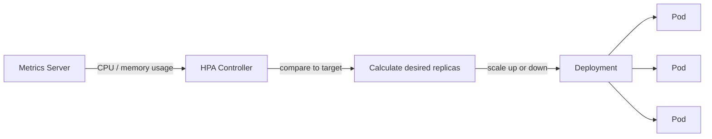

### How the Scaling Calculation Works

```
desiredReplicas = ceil(currentReplicas × (currentMetric / targetMetric))
```

Example: 2 pods running, each at 90% CPU, target is 50% CPU:
```
ceil(2 × (90 / 50)) = ceil(3.6) = 4 pods
```

HPA has a built-in cooldown to avoid flapping — scale-up is responsive; scale-down is conservative (default 5-minute window).

### Prerequisites

Metrics Server must be installed in the cluster:

```bash
# Check if metrics-server is running
kubectl get deployment metrics-server -n kube-system

# View current CPU/memory usage
kubectl top pods
kubectl top nodes
```

### HPA Manifest (CPU-based)

```yaml
apiVersion: autoscaling/v2
kind: HorizontalPodAutoscaler
metadata:
  name: web-hpa
  namespace: default
spec:
  scaleTargetRef:
    apiVersion: apps/v1
    kind: Deployment
    name: web
  minReplicas: 2
  maxReplicas: 10
  metrics:
    - type: Resource
      resource:
        name: cpu
        target:
          type: Utilization
          averageUtilization: 70    # target 70% CPU utilization
```

### HPA with Multiple Metrics

HPA evaluates all metrics and uses the **highest** resulting replica count:

```yaml
spec:
  metrics:
    - type: Resource
      resource:
        name: cpu
        target:
          type: Utilization
          averageUtilization: 70
    - type: Resource
      resource:
        name: memory
        target:
          type: AverageValue
          averageValue: "512Mi"
    - type: Pods
      pods:
        metric:
          name: requests_per_second   # custom metric from Prometheus adapter
        target:
          type: AverageValue
          averageValue: "1000"
```

### Scaling Behaviour Tuning

```yaml
spec:
  behavior:
    scaleUp:
      stabilizationWindowSeconds: 60    # wait 60s before scaling up again
      policies:
        - type: Pods
          value: 4                       # add at most 4 pods per period
          periodSeconds: 60
    scaleDown:
      stabilizationWindowSeconds: 300   # wait 5min before scaling down
      policies:
        - type: Percent
          value: 25                      # remove at most 25% per period
          periodSeconds: 60
```

### HPA kubectl Commands

```bash
# View HPA status
kubectl get hpa
kubectl describe hpa web-hpa

# Watch HPA in real time
kubectl get hpa -w

# Create HPA imperatively
kubectl autoscale deployment web --min=2 --max=10 --cpu-percent=70
```

### HPA Status Fields to Watch

```bash
kubectl get hpa web-hpa
# NAME      REFERENCE        TARGETS   MINPODS  MAXPODS  REPLICAS  AGE
# web-hpa   Deployment/web   45%/70%   2        10       3         5m
```

| Field | Meaning |
|---|---|
| `TARGETS` | Current metric value / target (e.g. `45%/70%`) |
| `REPLICAS` | Current number of replicas |
| `MINPODS` / `MAXPODS` | Bounds set in spec |

---

## 14. Vertical Pod Autoscaler (VPA)

### What Is VPA?

The **Vertical Pod Autoscaler** automatically adjusts the **CPU and memory requests/limits** of containers in a pod. Instead of adding more pods (horizontal), it right-sizes the existing ones.

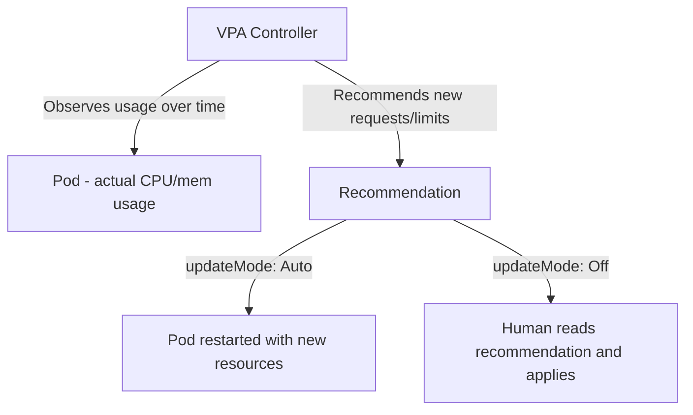

### VPA Components

| Component | Role |
|---|---|
| **Recommender** | Monitors historical resource usage and computes recommendations |
| **Updater** | Evicts pods that are running with outdated resource settings |
| **Admission Plugin** | Intercepts pod creation and injects recommended resource values |

### VPA Update Modes

| Mode | Behaviour |
|---|---|
| `Off` | Only compute and store recommendations — no changes made |
| `Initial` | Apply recommendations only at pod creation — no live updates |
| `Recreate` | Evict pods and recreate with new resources when recommendation changes significantly |
| `Auto` | Currently same as `Recreate` — may gain in-place updates in future |

### VPA Manifest

```yaml
apiVersion: autoscaling.k8s.io/v1
kind: VerticalPodAutoscaler
metadata:
  name: web-vpa
  namespace: default
spec:
  targetRef:
    apiVersion: apps/v1
    kind: Deployment
    name: web
  updatePolicy:
    updateMode: "Off"          # start with Off to only see recommendations
  resourcePolicy:
    containerPolicies:
      - containerName: nginx
        minAllowed:
          cpu: "50m"
          memory: "64Mi"
        maxAllowed:
          cpu: "2"
          memory: "2Gi"
        controlledResources: ["cpu", "memory"]
```

### Reading VPA Recommendations

```bash
kubectl describe vpa web-vpa
```

Output includes:
```
Recommendation:
  Container Recommendations:
    Container Name: nginx
    Lower Bound:
      Cpu:    50m
      Memory: 128Mi
    Target:                  ← apply this
      Cpu:    200m
      Memory: 256Mi
    Upper Bound:
      Cpu:    500m
      Memory: 512Mi
    Uncapped Target:
      Cpu:    180m
      Memory: 240Mi
```

Apply the recommendation manually by updating the Deployment's resource requests.

### HPA vs VPA vs Cluster Autoscaler

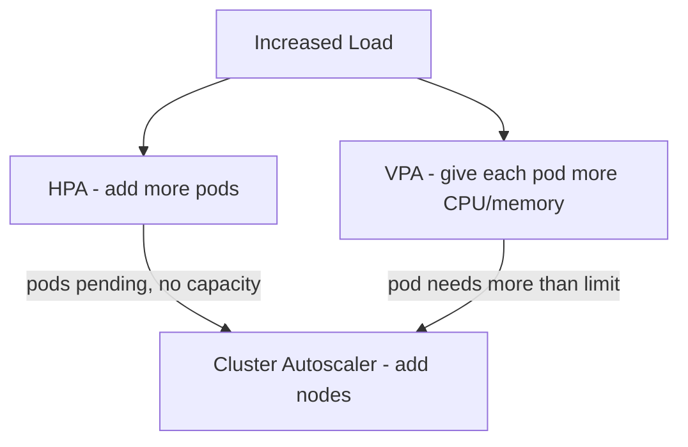

| Autoscaler | Scales | What changes | Best for |
|---|---|---|---|
| HPA | Horizontally | Number of pod replicas | Stateless services with variable request rate |
| VPA | Vertically | CPU/memory per pod | Workloads with variable resource needs, right-sizing |
| Cluster Autoscaler | Node pool | Number of nodes | When pod scheduling fails due to insufficient node capacity |

### HPA + VPA Together

Running HPA and VPA together on the same Deployment can cause conflicts (both trying to control pod count and resources simultaneously). Safe combinations:

| Combination | Safe? | Notes |
|---|---|---|
| HPA (CPU) + VPA (memory only) | ✅ | Limit VPA to memory; HPA controls CPU-based scaling |
| HPA (custom metric) + VPA (CPU+memory) | ✅ | HPA uses non-resource metric; no conflict |
| HPA (CPU) + VPA (CPU) | ❌ | Both compete on CPU — avoid |
| VPA `Off` mode + HPA | ✅ | VPA in recommendation mode only — safe always |

---

## Workload Selection Guide

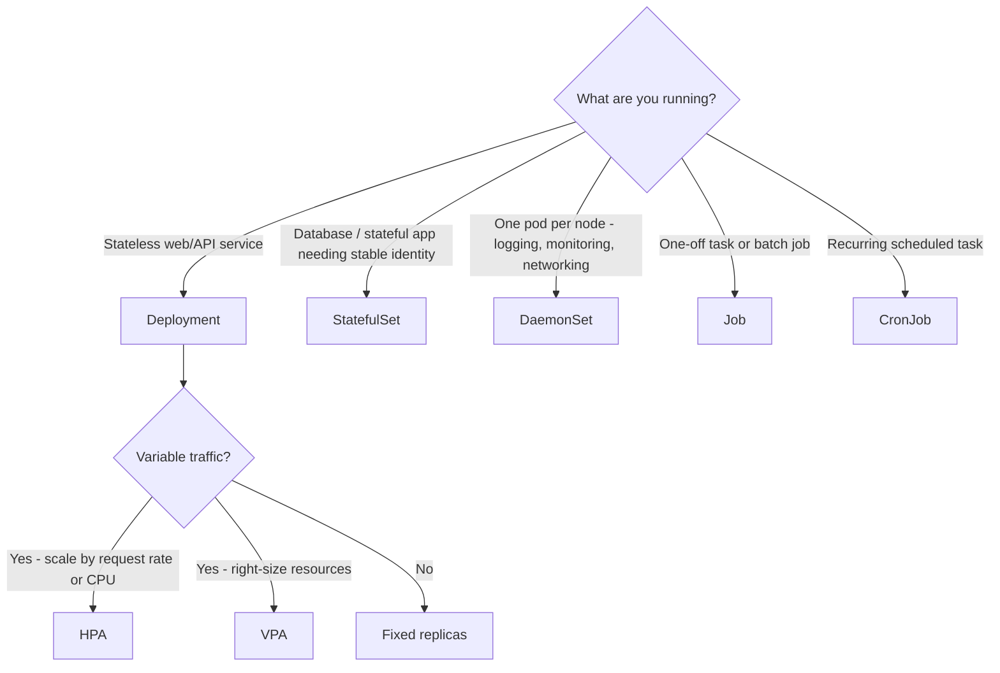

---

## Comparison Table

| Workload | Replicas | Pod identity | Persistent storage | Ordered ops | Use case |
|---|---|---|---|---|---|
| ReplicaSet | N identical | Random | No | No | Low-level pod management (use Deployment instead) |
| Deployment | N identical | Random | No | No | Stateless services, APIs, web apps |
| StatefulSet | N ordered | Stable (0,1,2...) | Yes (per-pod PVC) | Yes | Databases, brokers, distributed stores |
| DaemonSet | 1 per node | Random | Optional | No | Node-level agents, plugins, proxies |
| Job | 1+ to completion | Random | No | No | Batch tasks, migrations |
| CronJob | Scheduled Jobs | Random | No | No | Recurring batch, scheduled reports |

---

## Quick Reference

```bash
# Deployments
kubectl get deployments
kubectl rollout status deployment/<name>
kubectl rollout history deployment/<name>
kubectl rollout undo deployment/<name>
kubectl rollout restart deployment/<name>
kubectl scale deployment <name> --replicas=5

# StatefulSets
kubectl get statefulsets
kubectl get sts                              # shorthand
kubectl scale sts <name> --replicas=5

# DaemonSets
kubectl get daemonsets
kubectl get ds                               # shorthand
kubectl describe ds <name>

# Jobs
kubectl get jobs
kubectl logs job/<name>
kubectl delete job <name>

# CronJobs
kubectl get cronjobs
kubectl get cj                               # shorthand
kubectl create job --from=cronjob/<name> <manual-name>

# HPA
kubectl get hpa
kubectl describe hpa <name>
kubectl autoscale deployment <name> --min=2 --max=10 --cpu-percent=70

# VPA
kubectl get vpa
kubectl describe vpa <name>
```

---

## Summary

| Topic | Core idea |
|---|---|
| ReplicaSet | Ensures N pod replicas always running via reconciliation loop |
| Deployment | Manages ReplicaSets; adds rolling updates, rollback, revision history |
| StatefulSet | Ordered, stable-identity pods with per-pod persistent storage |
| DaemonSet | Exactly one pod per node — for cluster-wide agents and plugins |
| Job | Run pods to successful completion for batch/one-time tasks |
| CronJob | Schedule Jobs using cron syntax — for recurring workloads |
| HPA | Scale pod count based on CPU, memory, or custom metrics |
| VPA | Right-size pod resource requests/limits based on observed usage |
