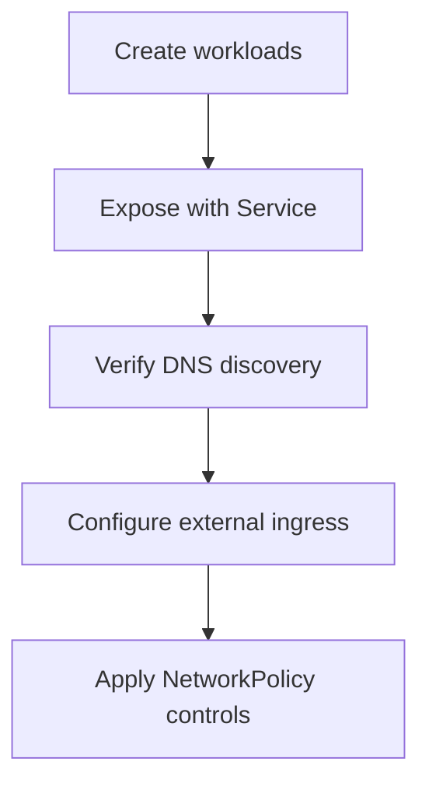
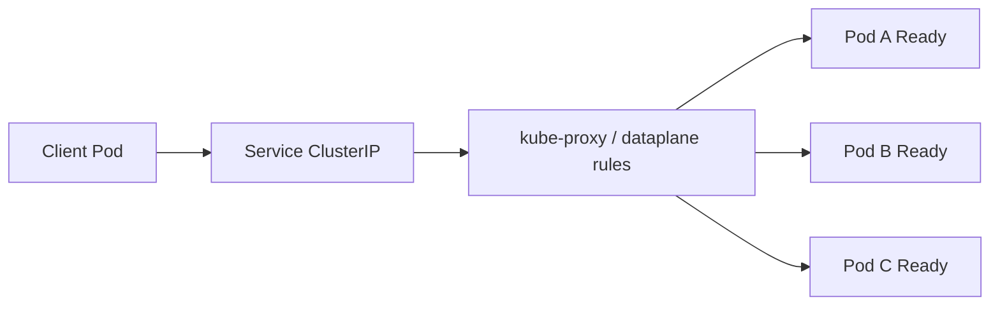
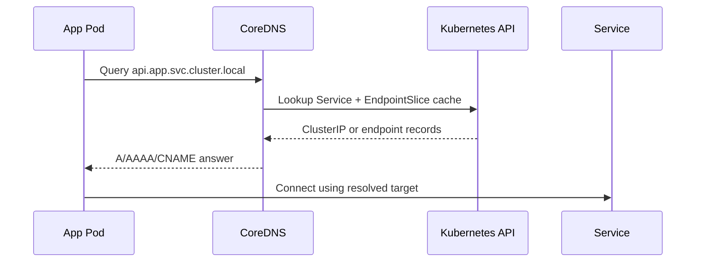
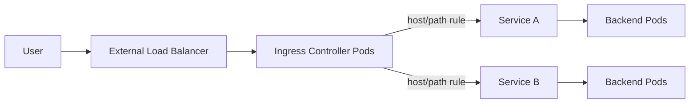
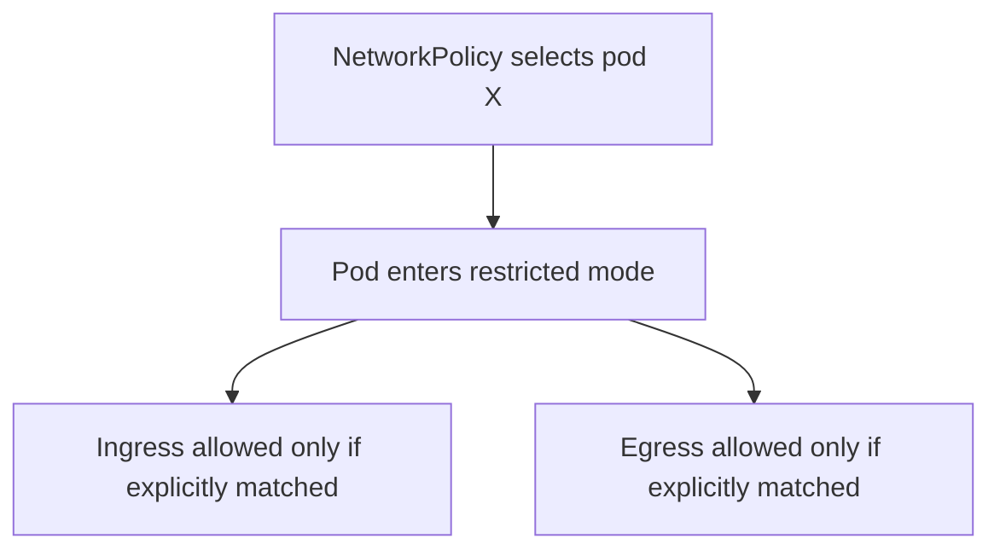
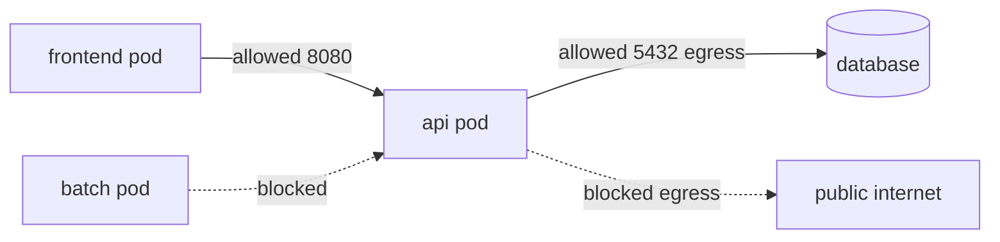
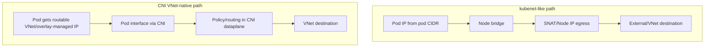
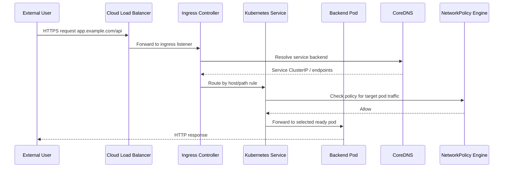

# Kubernetes Networking (Stage 3)

## What is it?
Kubernetes networking defines how pods and services communicate inside the cluster and how external traffic reaches workloads.

## What is it used for?
- Service discovery and stable service endpoints
- Exposing apps with Ingress controllers
- Enforcing traffic boundaries with NetworkPolicy and CNI behavior

## Why is it important?
Networking issues are a common source of outages; correct service and policy design is essential for stable systems.

## Workflow


## Topics Covered
15. Services
16. DNS in Kubernetes
17. Ingress and Ingress Controllers
18. Network Policies
19. CNI plugins

Additional deep-dive: **CNI vs kubenet (expert-level comparison)**

---

## 15) Services — How Pods Are Exposed

### Why Services exist
Pods are ephemeral. Their IP addresses change when they restart or get rescheduled. A Kubernetes **Service** gives a stable virtual IP and DNS name in front of matching pods.

Without Services:
- clients must track pod IP churn
- load balancing logic moves into app code
- rolling updates become fragile

With Services:
- clients talk to a stable endpoint
- kube-proxy and the cluster dataplane route traffic to live pods
- readiness gates traffic during rollouts

---

### Service types

| Type | Reachability | Typical use | Notes |
|---|---|---|---|
| `ClusterIP` (default) | Inside cluster only | internal APIs, DB proxies | Stable virtual IP; not directly reachable from internet |
| `NodePort` | `<NodeIP>:<nodePort>` from outside | basic external access, labs | Opens same port on every node (range 30000–32767 by default) |
| `LoadBalancer` | External IP or hostname | production north-south traffic | Cloud provider creates LB and points to node backends |
| `ExternalName` | DNS CNAME alias | map in-cluster name to external DNS | No proxying; only DNS aliasing |
| Headless (`clusterIP: None`) | Direct pod DNS records | StatefulSets, client-side balancing | No virtual IP, no kube-proxy load balancing |

---

### Service data path (ClusterIP)



Kubernetes creates **EndpointSlices** listing ready pod IPs. kube-proxy (or eBPF dataplane) programs node networking rules accordingly.

---

### Service manifest examples

#### ClusterIP
```yaml
apiVersion: v1
kind: Service
metadata:
  name: api
  namespace: app
spec:
  type: ClusterIP
  selector:
    app: api
  ports:
    - name: http
      port: 80
      targetPort: 8080
```

#### NodePort
```yaml
apiVersion: v1
kind: Service
metadata:
  name: api-nodeport
  namespace: app
spec:
  type: NodePort
  selector:
    app: api
  ports:
    - port: 80
      targetPort: 8080
      nodePort: 32080
```

#### LoadBalancer
```yaml
apiVersion: v1
kind: Service
metadata:
  name: api-lb
  namespace: app
spec:
  type: LoadBalancer
  selector:
    app: api
  ports:
    - port: 80
      targetPort: 8080
```

---

### Service session behavior

| Feature | Meaning |
|---|---|
| `sessionAffinity: ClientIP` | same client IP tends to hit same backend pod |
| `externalTrafficPolicy: Local` | preserves client source IP (fewer backend nodes eligible) |
| `internalTrafficPolicy: Local` | restricts in-cluster routing to same-node backends when possible |
| Topology hints | prefer closer backends (zone-aware traffic) |

---

### Expert Section — Services
- Service load balancing is **L4** (TCP/UDP), not L7.
- Readiness probes control endpoint inclusion; failing readiness removes pod from Service endpoints.
- EndpointSlice replaced legacy Endpoints for scale.
- In high-scale clusters, dataplane choice (iptables vs IPVS vs eBPF) has major impact on latency and rule churn.
- `externalTrafficPolicy: Local` preserves source IP but can cause uneven load if backend pods are not present on all nodes.
- For low-latency intra-zone traffic, combine topology-aware routing with zone-balanced replica placement.
- In high-connection workloads, validate conntrack limits and node kernel tuning to avoid intermittent packet drops.

---

## 16) DNS in Kubernetes — Service Discovery

### CoreDNS role
Kubernetes DNS is typically provided by **CoreDNS** running in `kube-system`. It watches Services and EndpointSlices and answers DNS queries for cluster names.

---

### Naming patterns

| Object | Name pattern |
|---|---|
| Service short name (same namespace) | `service-name` |
| Service cross-namespace | `service-name.namespace` |
| Full service FQDN | `service-name.namespace.svc.cluster.local` |
| Pod DNS (headless/stateful) | `pod-ordinal.service.namespace.svc.cluster.local` |

---

### DNS resolution flow



---

### `/etc/resolv.conf` search behavior
Pods typically get search domains like:
- `app.svc.cluster.local`
- `svc.cluster.local`
- `cluster.local`

So querying `api` in namespace `app` resolves to `api.app.svc.cluster.local`.

---

### DNS pitfalls and best practices

| Pitfall | Impact | Fix |
|---|---|---|
| Very low DNS TTL assumptions | stale endpoint behavior expectations | rely on Service abstraction, not pod DNS for stateless apps |
| Using pod IPs directly | brittle during reschedule | use Service names |
| Excessive DNS QPS from apps | CoreDNS pressure | enable app-side caching, tune CoreDNS autoscaling |
| External DNS dependency outages | app startup failures | use retries/backoff, avoid hard fail at startup |

---

### Expert Section — DNS in Kubernetes

- CoreDNS is in the data path for service discovery; DNS saturation can become a cluster-wide bottleneck under bursty microservice traffic.
- For high-QPS service meshes, node-local DNS caching can reduce cross-node DNS latency and CoreDNS load.
- Headless services return per-pod records; this is useful for stateful systems but can increase client-side complexity.
- DNS failures and NetworkPolicy are tightly coupled: if egress to DNS is blocked, many apps fail in non-obvious ways.
- Negative caching behavior can delay recovery from short-lived discovery failures; monitor both success and NXDOMAIN rates.

---

## 17) Ingress and Ingress Controllers

### Ingress in one line
An **Ingress** defines HTTP/HTTPS routing rules (host/path/TLS). An **Ingress Controller** enforces those rules (NGINX, Traefik, HAProxy, cloud-native controllers, etc.).

Ingress resource alone does nothing until a controller is installed.

---

### Request flow



---

### Ingress features

| Feature | What it does |
|---|---|
| Host-based routing | `api.example.com` vs `admin.example.com` |
| Path-based routing | `/api` to service A, `/web` to service B |
| TLS termination | controller handles HTTPS cert/key |
| Rewrite/redirect | URL rewrites, force HTTP→HTTPS |
| Canary/blue-green (controller-specific) | weighted or header-based split |

---

### Ingress manifest

```yaml
apiVersion: networking.k8s.io/v1
kind: Ingress
metadata:
  name: app-ingress
  namespace: app
  annotations:
    nginx.ingress.kubernetes.io/ssl-redirect: "true"
spec:
  ingressClassName: nginx
  tls:
    - hosts:
        - app.example.com
      secretName: app-tls
  rules:
    - host: app.example.com
      http:
        paths:
          - path: /api
            pathType: Prefix
            backend:
              service:
                name: api
                port:
                  number: 80
          - path: /
            pathType: Prefix
            backend:
              service:
                name: web
                port:
                  number: 80
```

---

### Ingress vs LoadBalancer Service

| Criteria | Ingress | LoadBalancer Service |
|---|---|---|
| Protocol focus | HTTP/HTTPS (L7) | TCP/UDP (L4) |
| Multiple apps on one IP | Yes (host/path routing) | Usually one service per LB |
| TLS offload | Native | possible but service-specific |
| Advanced routing | Strong | limited |

---

### Gateway API note (advanced)
For new platform designs, evaluate **Gateway API** (Gateway/HTTPRoute/TCPRoute) as a more expressive successor to classic Ingress.

---

### Expert Section — Ingress and Ingress Controllers

- Ingress gives L7 routing, but performance characteristics depend on controller implementation and config (buffering, keepalive, worker model).
- TLS termination at ingress centralizes certificate lifecycle, but mTLS to backends may still be required for strict zero-trust architectures.
- Preserve or forward source context correctly (`X-Forwarded-For`, `X-Forwarded-Proto`) to avoid auth, audit, and redirect bugs.
- Multi-tenant ingress needs hard guardrails: namespace isolation, admission checks on host collisions, and per-team rate limits.
- For advanced traffic policy (weighted routing, retries, circuit breaking), use Gateway API or service mesh patterns where needed.

---

## 18) Network Policies — Pod-Level Firewall

### What NetworkPolicy does
By default, many clusters are "allow-all" east-west traffic. **NetworkPolicy** lets you define allowed ingress/egress for selected pods.

Important: policies only work if your CNI implements them.

---

### Default deny and allow-list model



Once a pod is selected by an ingress policy, ingress is deny-by-default except allowed rules. Same logic for egress.

---

### Example: default deny all ingress in namespace

```yaml
apiVersion: networking.k8s.io/v1
kind: NetworkPolicy
metadata:
  name: default-deny-ingress
  namespace: app
spec:
  podSelector: {}
  policyTypes:
    - Ingress
```

### Example: allow only frontend pods to call api on 8080

```yaml
apiVersion: networking.k8s.io/v1
kind: NetworkPolicy
metadata:
  name: api-allow-frontend
  namespace: app
spec:
  podSelector:
    matchLabels:
      app: api
  policyTypes:
    - Ingress
  ingress:
    - from:
        - podSelector:
            matchLabels:
              app: frontend
      ports:
        - protocol: TCP
          port: 8080
```

---

### Ingress + Egress model visualization



---

### NetworkPolicy strategy for production
1. Start with namespace-level default deny (ingress and egress)
2. Add minimal allow policies per app flow
3. Explicitly allow DNS egress (`kube-dns`/CoreDNS)
4. Add observability before broad rollout (flow logs/eBPF telemetry)
5. CI test policies using policy-aware integration tests

---

### Expert Section — Network Policies

- NetworkPolicy is additive allow logic, not ordered firewall rules. Reasoning must be based on the union of all matching policies.
- Policy intent should be modeled from service dependency graphs; ad-hoc rule authoring creates drift and accidental broad allow.
- Egress policies are often skipped in early designs; in production, egress control is essential for data exfiltration risk reduction.
- `namespaceSelector` and `podSelector` combinations are powerful but easy to misapply—use stable labels and policy linting.
- Verify enforcement with runtime tests (not only YAML review), because plugin capabilities and defaults vary by CNI.

---

## 19) CNI Plugins — Dataplane and IPAM

### What CNI is
**CNI (Container Network Interface)** is the plugin standard Kubernetes uses to configure pod networking.

A CNI plugin typically handles:
- Pod interface setup
- IP address management (IPAM)
- Routing/overlay behavior
- NetworkPolicy enforcement (if supported)
- Optional encryption/observability

---

### Popular CNIs and trade-offs

| CNI | Dataplane style | NetworkPolicy | Strengths | Considerations |
|---|---|---|---|---|
| Flannel | simple overlay (VXLAN) | No native policy enforcement | very simple, low ops complexity | limited advanced security features |
| Calico | routed or overlay + iptables/eBPF | Yes | mature policy model, strong ecosystem | policy complexity in large orgs |
| Cilium | eBPF dataplane | Yes (L3–L7 extensions) | high performance, rich observability, advanced policy | steeper learning curve, kernel feature dependency |
| Azure CNI (AKS) | VNet-native or overlay modes | Yes (with policy engines) | deep Azure integration | IP planning differs by mode |

---

## Expert Deep-Dive: CNI vs kubenet

> kubenet is AKS-specific legacy node networking mode; CNI is the broader plugin architecture and modern direction.

### Conceptual difference

| Topic | CNI-based networking | kubenet |
|---|---|---|
| What it is | Plugin standard + implementation | AKS network mode that bridges pod traffic via node and UDR/NAT behavior |
| Pod IP model | Depends on CNI plugin/mode (VNet-native or overlay) | Pods use separate CIDR behind node, typically SNAT for outbound |
| Routability from VNet | In VNet-native CNI, pod IPs are first-class in VNet | Pod IPs usually not first-class VNet citizens |
| Scale characteristics | Depends on chosen CNI/IPAM mode; modern modes scale better operationally | simpler early model but with routing and policy limitations at scale |
| Policy features | rich with Calico/Cilium/eBPF etc. | historically more limited, depends on add-ons |
| Strategic direction | actively evolving (Cilium/eBPF/Gateway API integrations) | legacy path in AKS; newer clusters should prefer Azure CNI modes |

---

### Data path contrast



### Operational impact (expert view)

| Area | CNI (modern modes) | kubenet |
|---|---|---|
| IP planning | can be VNet-intensive (native) or optimized (overlay modes) | simpler pod CIDR separation, but can add NAT/debug complexity |
| Troubleshooting | richer telemetry if using eBPF/advanced tooling | often node-centric troubleshooting |
| Security | stronger policy granularity with policy-capable CNIs | less expressive without advanced add-ons |
| Performance | eBPF-based dataplanes reduce iptables overhead at scale | can rely more on classic node routing/NAT paths |
| Future readiness | aligns with modern AKS and CNCF networking evolution | not ideal for new enterprise platforms |

---

### Recommendation
For new enterprise AKS builds, prefer **Azure CNI modern modes** (including overlay where appropriate) and choose a policy/observability model intentionally. Treat kubenet as a legacy compatibility option, not a forward architecture baseline.

---

## End-to-End Networking Workflow (Putting it together)



---

## Practical YAML bundle (Service + Ingress + NetworkPolicy)

```yaml
apiVersion: v1
kind: Namespace
metadata:
  name: app
---
apiVersion: apps/v1
kind: Deployment
metadata:
  name: api
  namespace: app
spec:
  replicas: 2
  selector:
    matchLabels:
      app: api
  template:
    metadata:
      labels:
        app: api
    spec:
      containers:
        - name: api
          image: hashicorp/http-echo
          args: ["-text=api-ok"]
          ports:
            - containerPort: 5678
---
apiVersion: v1
kind: Service
metadata:
  name: api
  namespace: app
spec:
  selector:
    app: api
  ports:
    - port: 80
      targetPort: 5678
---
apiVersion: networking.k8s.io/v1
kind: Ingress
metadata:
  name: app-ingress
  namespace: app
spec:
  ingressClassName: nginx
  rules:
    - host: app.example.com
      http:
        paths:
          - path: /api
            pathType: Prefix
            backend:
              service:
                name: api
                port:
                  number: 80
---
apiVersion: networking.k8s.io/v1
kind: NetworkPolicy
metadata:
  name: api-ingress-allow
  namespace: app
spec:
  podSelector:
    matchLabels:
      app: api
  policyTypes: [Ingress]
  ingress:
    - from:
        - namespaceSelector:
            matchLabels:
              kubernetes.io/metadata.name: ingress-nginx
      ports:
        - protocol: TCP
          port: 5678
```

---

## Commands to verify networking

```bash
# Services and endpoints
kubectl get svc -A
kubectl get endpointslice -A

# DNS test from a temporary pod
kubectl run dns-test --rm -it --image=busybox:1.36 --restart=Never -- nslookup api.app.svc.cluster.local

# Ingress and controller status
kubectl get ingress -A
kubectl get pods -n ingress-nginx

# NetworkPolicy visibility
kubectl get networkpolicy -A
kubectl describe networkpolicy -n app api-ingress-allow

# CNI clues
kubectl get pods -n kube-system -o wide
kubectl get ds -n kube-system
```

---

## Troubleshooting checklist

| Symptom | Check first |
|---|---|
| Service has no traffic | selector mismatch; no ready endpoints |
| DNS lookup fails | CoreDNS pods, kube-dns service, pod DNS policy |
| Ingress 404/503 | host/path mismatch, backend service port mismatch, controller class |
| NetworkPolicy blocks expected traffic | default-deny in effect, missing namespace/pod selectors, missing DNS egress |
| Pod-to-pod cross-node issues | CNI daemon health, node routes, MTU mismatch |

---

## Summary

| Topic | Core takeaway |
|---|---|
| Services | stable L4 endpoint for ephemeral pods |
| DNS | CoreDNS-backed service discovery via predictable names |
| Ingress | L7 HTTP/HTTPS routing through controller |
| NetworkPolicy | zero-trust pod firewalling with explicit allow rules |
| CNI | dataplane/IPAM foundation that determines performance, security, and operability |
| CNI vs kubenet | modern CNI modes are the forward path; kubenet is legacy and less suitable for new enterprise designs |
