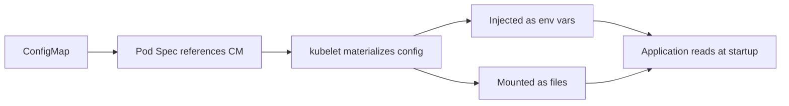
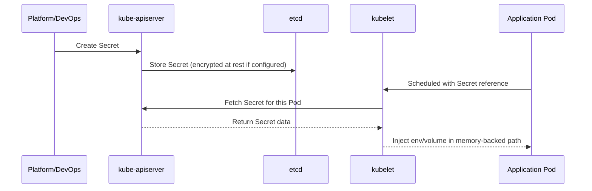
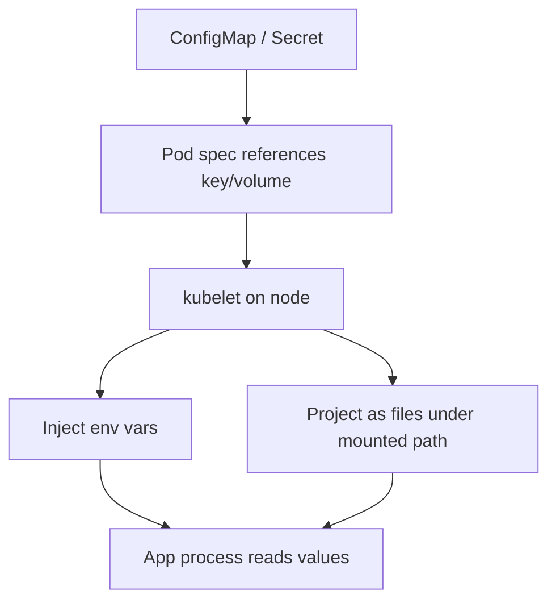
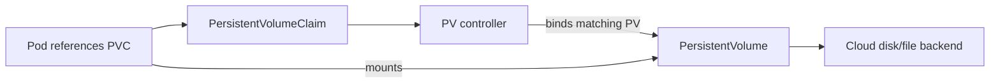
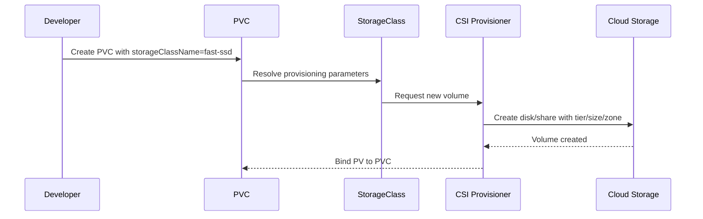
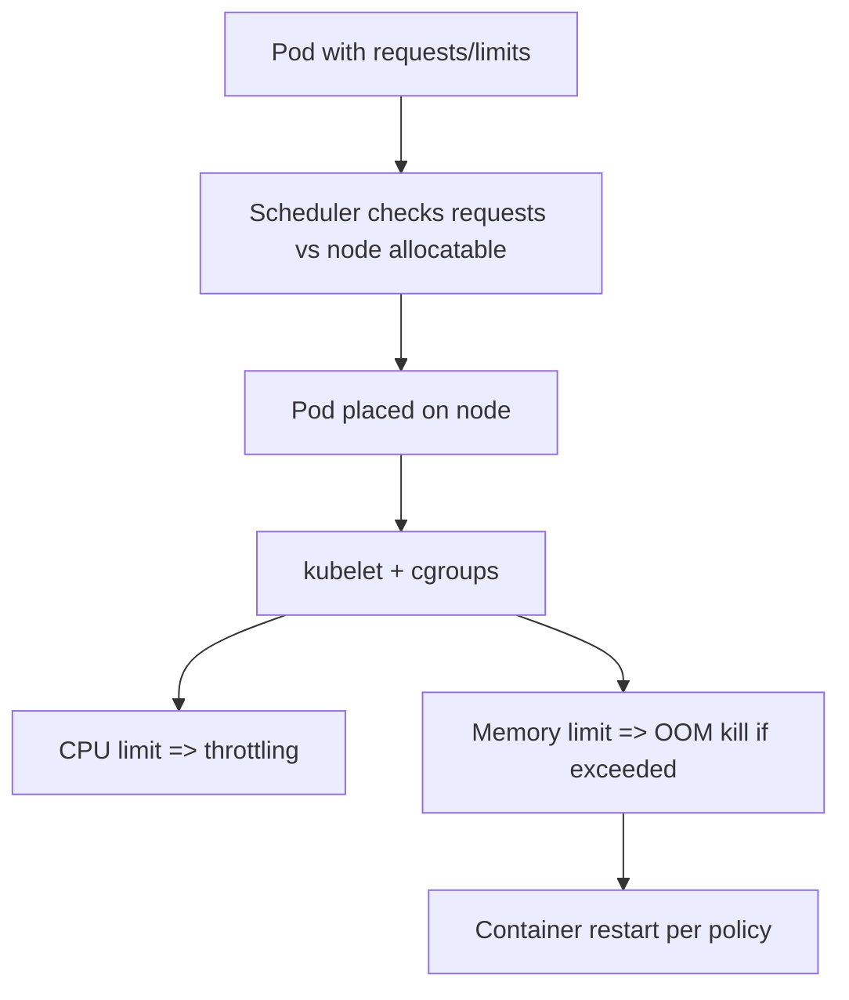
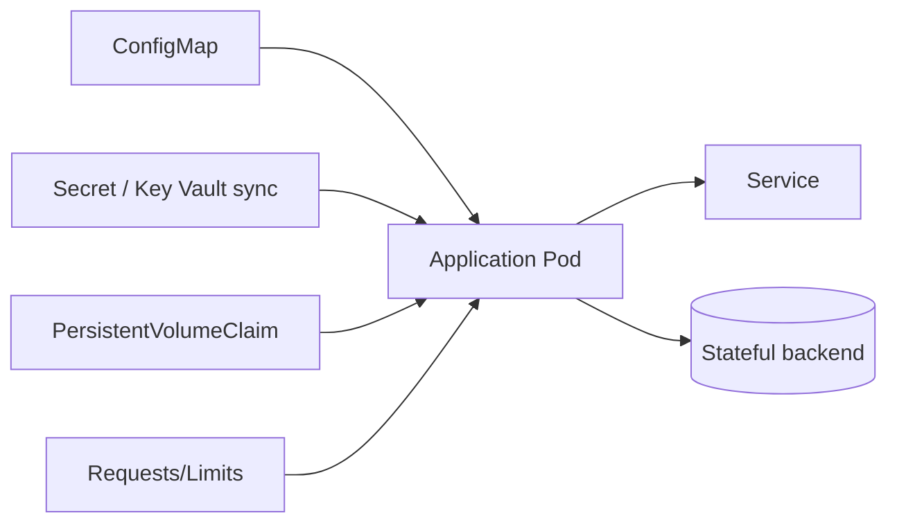

# Kubernetes Configuration and Storage (Stage 4)

## Topics Covered
20. ConfigMaps
21. Secrets
22. Environment Variables and Volume Mounts
23. Persistent Volumes (PV) and PersistentVolumeClaims (PVC)
24. StorageClasses
25. Resource Requests and Limits

---

## 20) ConfigMaps — Externalizing Application Configuration

### What a ConfigMap is
A ConfigMap stores non-sensitive configuration as key-value pairs and decouples runtime configuration from container images.

Use cases:
- Feature flags
- App mode (`dev`, `staging`, `prod`)
- Endpoint URLs
- Properties files (`application.properties`, `.env`, JSON snippets)

### Why ConfigMaps matter architecturally
Without ConfigMaps:
- config is baked into image layers
- changing a value requires image rebuild + redeploy
- environment drift increases

With ConfigMaps:
- config can be promoted per environment independently
- the same image runs everywhere
- operational changes become faster and safer

---

### ConfigMap creation patterns

#### From literals
```bash
kubectl create configmap app-config \
  --from-literal=APP_MODE=production \
  --from-literal=LOG_LEVEL=info \
  -n app
```

#### From files
```bash
kubectl create configmap app-properties \
  --from-file=application.properties \
  -n app
```

#### Declarative YAML
```yaml
apiVersion: v1
kind: ConfigMap
metadata:
  name: app-config
  namespace: app
data:
  APP_MODE: production
  LOG_LEVEL: info
  DB_HOST: postgres.app.svc.cluster.local
  FEATURE_X_ENABLED: "true"
```

---

### ConfigMap usage workflow



---

### Expert Section — ConfigMaps

- ConfigMap changes do **not** automatically restart pods using env var injection; roll deployments explicitly.
- Volume-mounted ConfigMaps update on node sync intervals, but app hot-reload behavior is app-dependent.
- For deterministic rollouts, use checksum annotations in Deployment templates tied to ConfigMap content.
- Keep ConfigMaps small and cohesive by domain (app config, logging config, feature config), not a single mega-object.
- Treat ConfigMaps as versioned config artifacts under GitOps, not ad-hoc imperative edits in production.

---

## 21) Secrets — Sensitive Configuration

### What a Secret is
A Secret stores sensitive data such as:
- API tokens
- DB passwords
- TLS keys/certs
- private credentials for external systems

> Base64 in YAML is **encoding**, not encryption.

### Secret types

| Type | Use |
|---|---|
| `Opaque` | generic key-value secret |
| `kubernetes.io/tls` | TLS cert + private key |
| `kubernetes.io/dockerconfigjson` | private registry credentials |
| `kubernetes.io/basic-auth` | username/password format |

---

### Secret examples

#### Opaque secret (YAML)
```yaml
apiVersion: v1
kind: Secret
metadata:
  name: db-secret
  namespace: app
type: Opaque
stringData:
  DB_USER: app_user
  DB_PASSWORD: change-me
```

`stringData` is easier to author; API server converts to base64 in `data` field.

#### TLS secret
```bash
kubectl create secret tls app-tls \
  --cert=./tls.crt \
  --key=./tls.key \
  -n app
```

---

### Secret security workflow



---

### Key Vault integration patterns

#### Pattern A — CSI Secret Store (runtime mount)
- Pod mounts secret directly from Key Vault via CSI driver
- no Kubernetes Secret persistence required (optional sync available)
- best for short-lived, centrally rotated secrets

#### Pattern B — External Secrets Operator
- controller pulls secrets from Key Vault and syncs to Kubernetes Secrets
- app continues using native Secret references
- easier compatibility with legacy charts/workloads

#### Pattern C — App-level SDK fetch
- app uses managed identity/workload identity + SDK to fetch from Key Vault at runtime
- highest app control, but adds code complexity

---

### Expert Section — Secrets

- Enable etcd encryption at rest for Secrets (API object encryption config).
- Restrict Secret read via RBAC; many incidents come from over-broad `get/list` on secrets.
- Prefer volume mounts over env vars for high-sensitivity values (env vars are easier to leak via process dumps/logs).
- Rotate secrets with short TTL and automate restart/reload pipelines.
- Use workload identity + external secret providers to reduce static credential footprint.

---

## 22) Environment Variables and Volume Mounts

### How config/secrets reach containers

Two primary injection methods:

| Method | Best for | Behavior |
|---|---|---|
| Environment variables | simple scalar config | loaded at process start |
| Volume mounts | file-based config/secrets, cert bundles | files available in container FS |

---

### Env var injection example
```yaml
apiVersion: apps/v1
kind: Deployment
metadata:
  name: api
  namespace: app
spec:
  replicas: 2
  selector:
    matchLabels:
      app: api
  template:
    metadata:
      labels:
        app: api
    spec:
      containers:
        - name: api
          image: ghcr.io/example/api:1.0.0
          env:
            - name: APP_MODE
              valueFrom:
                configMapKeyRef:
                  name: app-config
                  key: APP_MODE
            - name: DB_PASSWORD
              valueFrom:
                secretKeyRef:
                  name: db-secret
                  key: DB_PASSWORD
```

### Volume mount example (ConfigMap + Secret)
```yaml
apiVersion: v1
kind: Pod
metadata:
  name: config-file-demo
  namespace: app
spec:
  containers:
    - name: app
      image: busybox
      command: ["sh", "-c", "sleep 3600"]
      volumeMounts:
        - name: app-config-vol
          mountPath: /etc/app-config
          readOnly: true
        - name: tls-vol
          mountPath: /etc/tls
          readOnly: true
  volumes:
    - name: app-config-vol
      configMap:
        name: app-config
    - name: tls-vol
      secret:
        secretName: app-tls
```

---

### Config delivery workflow



---

### Expert Section — Env and Mounts

- Env vars are immutable for a running process; config changes require restart unless app has external reload mechanism.
- Mounted files can update, but app must support reload (SIGHUP/inotify/reloader sidecar).
- Use `subPath` carefully; it disables some dynamic update behavior for projected volumes.
- Avoid large binary blobs in ConfigMaps/Secrets; use object storage or artifacts.
- For TLS cert rotation, volume mounts + app hot reload generally outperform env-based approaches.

---

## 23) Persistent Volumes (PV) and PersistentVolumeClaims (PVC)

### Core abstraction

- **PV**: cluster storage resource (actual disk/share abstraction)
- **PVC**: workload request for storage
- **Pod**: mounts PVC and reads/writes data

PVC decouples app manifests from specific storage implementation details.

---

### PV/PVC binding workflow



---

### Access modes

| Access mode | Meaning | Typical backend |
|---|---|---|
| `ReadWriteOnce` (RWO) | mounted read-write by one node | block disk |
| `ReadOnlyMany` (ROX) | many nodes read-only | shared file/object gateway |
| `ReadWriteMany` (RWX) | many nodes read-write | NFS/Azure Files/CSI shared files |
| `ReadWriteOncePod` | read-write by single pod only | CSI drivers supporting stricter semantics |

---

### PVC example
```yaml
apiVersion: v1
kind: PersistentVolumeClaim
metadata:
  name: app-data
  namespace: app
spec:
  accessModes:
    - ReadWriteOnce
  storageClassName: managed-csi
  resources:
    requests:
      storage: 20Gi
```

### Pod mounting PVC
```yaml
apiVersion: v1
kind: Pod
metadata:
  name: app-with-storage
  namespace: app
spec:
  containers:
    - name: app
      image: nginx:1.25
      volumeMounts:
        - name: data
          mountPath: /var/lib/app
  volumes:
    - name: data
      persistentVolumeClaim:
        claimName: app-data
```

---

### StatefulSet + PVC template pattern
StatefulSets can automatically create one PVC per pod using `volumeClaimTemplates`, giving stable storage identity per ordinal pod.

---

### Expert Section — PV/PVC

- Always model failure domain: zone-bound disks + pod rescheduling can cause attach delays across zones.
- Use snapshots for backup strategy; PVC alone is not a backup plan.
- Plan reclaim behavior explicitly (`Delete` vs `Retain`) to avoid data loss surprises.
- For databases, benchmark filesystem and mount options per storage class, not just capacity.
- Track PVC expansion support before committing to in-place growth strategy.

---

## 24) StorageClasses — Dynamic Provisioning and Lifecycle

### What a StorageClass is
A StorageClass defines *how* dynamic storage should be provisioned:
- provisioner/CSI driver
- performance tier
- filesystem type
- replication and topology behavior
- reclaim policy and expansion capability

When a PVC references a StorageClass, Kubernetes dynamically provisions a matching PV.

---

### StorageClass example
```yaml
apiVersion: storage.k8s.io/v1
kind: StorageClass
metadata:
  name: fast-ssd
provisioner: disk.csi.azure.com
allowVolumeExpansion: true
reclaimPolicy: Delete
volumeBindingMode: WaitForFirstConsumer
parameters:
  skuName: Premium_LRS
  cachingMode: ReadOnly
  fsType: xfs
```

### Why `WaitForFirstConsumer` matters
With zonal storage, provisioning waits until a pod is scheduled, then creates volume in the correct zone to avoid unschedulable attach patterns.

---

### Reclaim policies

| Policy | Effect after PVC deletion |
|---|---|
| `Delete` | underlying volume is deleted automatically |
| `Retain` | volume persists for manual recovery/reuse |
| `Recycle` | deprecated in most environments |

---

### Dynamic provisioning workflow



---

### Expert Section — StorageClasses

- Use multiple classes by workload profile (latency-sensitive DB, throughput logging, cheap archive).
- Treat StorageClass changes as platform API changes; communicate deprecations and migration plans.
- Enforce allowed classes via admission policies to prevent expensive tier misuse.
- For multi-zone clusters, align binding mode and topology constraints with scheduler behavior.
- Validate CSI driver upgrade compatibility with existing PVs before platform upgrades.

---

## 25) Resource Requests and Limits

### Requests vs limits

| Field | Scheduling effect | Runtime effect |
|---|---|---|
| `requests.cpu` / `requests.memory` | minimum resources reserved for placement | forms baseline for QoS + autoscaling metrics |
| `limits.cpu` / `limits.memory` | not used for initial placement directly | hard cap at runtime (CPU throttling, memory OOM kill) |

---

### Example resource policy in workload
```yaml
apiVersion: apps/v1
kind: Deployment
metadata:
  name: api
  namespace: app
spec:
  replicas: 3
  selector:
    matchLabels:
      app: api
  template:
    metadata:
      labels:
        app: api
    spec:
      containers:
        - name: api
          image: ghcr.io/example/api:1.0.0
          resources:
            requests:
              cpu: "250m"
              memory: "256Mi"
            limits:
              cpu: "1"
              memory: "512Mi"
```

---

### QoS classes

| QoS class | Criteria | Eviction priority |
|---|---|---|
| `Guaranteed` | every container has requests == limits for cpu & memory | last to evict |
| `Burstable` | at least one request/limit set, but not equal everywhere | medium |
| `BestEffort` | no requests/limits set | first to evict |

---

### Resource enforcement workflow



---

### Advanced tuning considerations

- CPU limits too low can cause throttling spikes and latency amplification.
- Memory limits too tight produce OOM kills under transient bursts.
- Set realistic requests from observed p50/p95 profiles; avoid copy-paste defaults.
- HPA on CPU requires requests to be meaningful, otherwise utilization math is misleading.
- Use VPA in recommendation mode to calibrate requests before enabling auto updates.

---

### Expert Section — Requests/Limits

- Resource management is a multi-layer contract: scheduler placement, kubelet cgroups, kernel OOM behavior.
- Avoid setting CPU limits blindly for latency-sensitive Java/Go APIs; measure throttling via cgroup metrics.
- Use namespace `LimitRange` and `ResourceQuota` to enforce guardrails and avoid noisy-neighbor impact.
- Align pod resources with node shapes to reduce fragmentation and pending pods.
- Define SLO-aware resource policies: low-latency services need headroom; batch workers can be burstable.

---

## Cross-topic architecture (Config + Secret + PVC + Resources)



---

## End-to-end example bundle

```yaml
apiVersion: v1
kind: Namespace
metadata:
  name: app
---
apiVersion: v1
kind: ConfigMap
metadata:
  name: app-config
  namespace: app
data:
  APP_MODE: production
  LOG_LEVEL: info
---
apiVersion: v1
kind: Secret
metadata:
  name: db-secret
  namespace: app
type: Opaque
stringData:
  DB_USER: app_user
  DB_PASSWORD: strong-password
---
apiVersion: storage.k8s.io/v1
kind: StorageClass
metadata:
  name: fast-ssd
provisioner: disk.csi.azure.com
allowVolumeExpansion: true
reclaimPolicy: Delete
volumeBindingMode: WaitForFirstConsumer
parameters:
  skuName: Premium_LRS
---
apiVersion: v1
kind: PersistentVolumeClaim
metadata:
  name: app-data
  namespace: app
spec:
  accessModes: ["ReadWriteOnce"]
  storageClassName: fast-ssd
  resources:
    requests:
      storage: 20Gi
---
apiVersion: apps/v1
kind: Deployment
metadata:
  name: api
  namespace: app
spec:
  replicas: 2
  selector:
    matchLabels:
      app: api
  template:
    metadata:
      labels:
        app: api
    spec:
      containers:
        - name: api
          image: nginx:1.25
          env:
            - name: APP_MODE
              valueFrom:
                configMapKeyRef:
                  name: app-config
                  key: APP_MODE
            - name: DB_PASSWORD
              valueFrom:
                secretKeyRef:
                  name: db-secret
                  key: DB_PASSWORD
          volumeMounts:
            - name: data
              mountPath: /var/lib/app
          resources:
            requests:
              cpu: "250m"
              memory: "256Mi"
            limits:
              cpu: "1"
              memory: "512Mi"
      volumes:
        - name: data
          persistentVolumeClaim:
            claimName: app-data
```

---

## Verification commands

```bash
# Config/Secret
kubectl get configmap,secret -n app
kubectl describe configmap app-config -n app
kubectl describe secret db-secret -n app

# Pod env and mounts
kubectl get pods -n app
kubectl describe pod -n app -l app=api
kubectl exec -n app deploy/api -- printenv | grep APP_MODE
kubectl exec -n app deploy/api -- ls -la /var/lib/app

# Storage
kubectl get sc
kubectl get pvc,pv -n app
kubectl describe pvc app-data -n app

# Resources/QoS
kubectl top pods -n app
kubectl describe pod -n app -l app=api | grep -A5 "Limits\|Requests\|QoS"
```

---

## Troubleshooting quick map

| Symptom | Likely cause | First checks |
|---|---|---|
| Pod stuck `CreateContainerConfigError` | missing ConfigMap/Secret key | `kubectl describe pod` events, key names |
| App sees old config after ConfigMap update | env var injection requires restart | rollout restart deployment |
| PVC pending | no compatible StorageClass / topology mismatch | `kubectl describe pvc`, SC parameters, node zones |
| OOMKilled | memory limit too low | `kubectl describe pod`, metrics, limit tuning |
| CPU throttling latency spikes | tight CPU limit | cgroup throttling metrics, raise/remove limit |

---

## Summary

| Topic | Expert takeaway |
|---|---|
| ConfigMaps | treat config as versioned runtime contract, not image content |
| Secrets | secure lifecycle requires RBAC, encryption-at-rest, rotation, and external secret sources |
| Env/Mounts | choose injection model based on reload semantics and sensitivity |
| PV/PVC | abstract storage safely, but design for topology, backup, and reclaim behavior |
| StorageClasses | platform-level storage API: tiering, lifecycle, and scheduler alignment |
| Requests/Limits | drive placement, performance, and reliability; tune from real telemetry |
