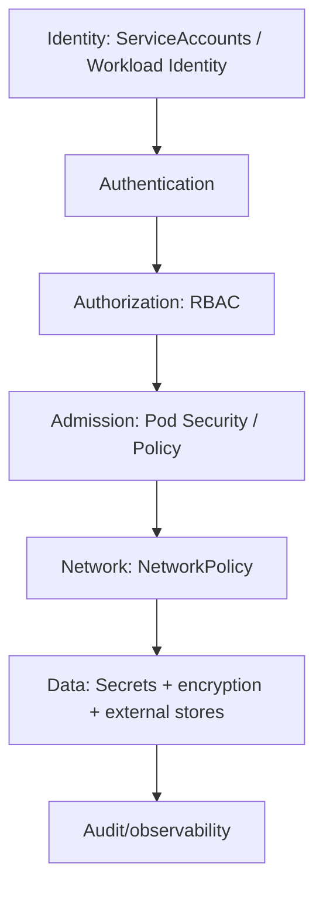
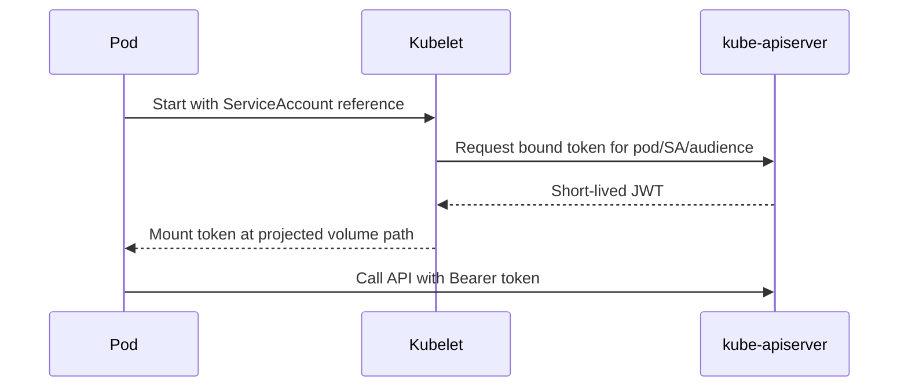
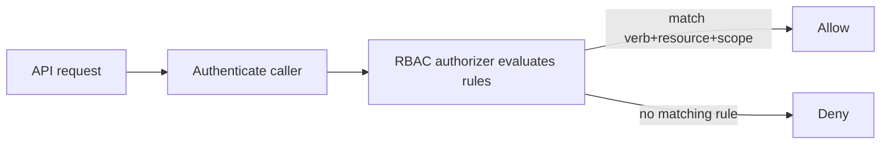
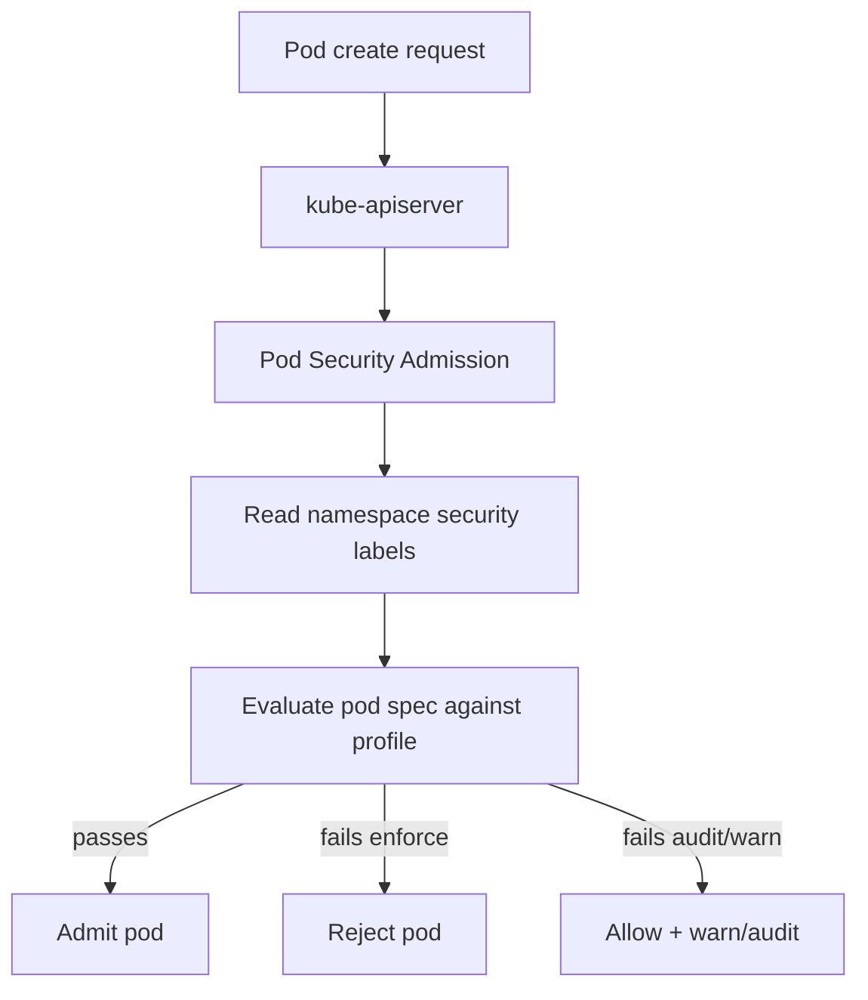
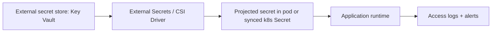
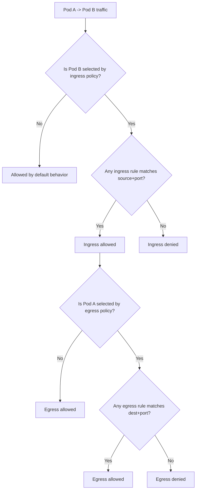
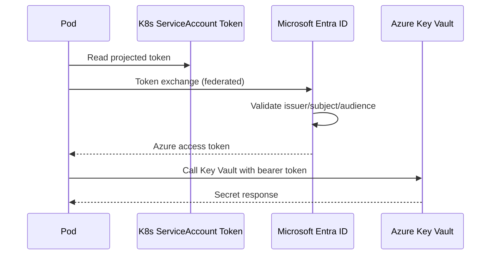
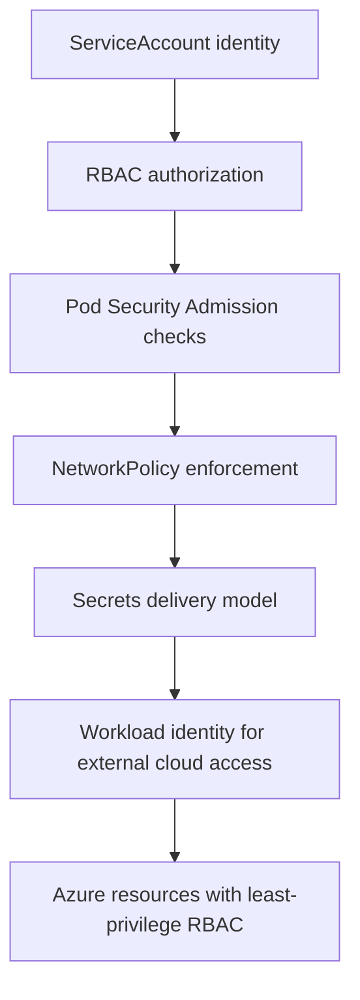

# Kubernetes Security (Stage 5)

## Topics Covered
26. Service Accounts
27. RBAC in Kubernetes
28. Pod Security (Pod Security Admission)
29. Secrets Management Best Practices
30. Network Policies (Deep Dive)
31. AKS Workload Identity

---

## Security Model Overview

Kubernetes security is multi-layered. No single control is sufficient.



Defense-in-depth means combining all layers consistently.

---

## 26) Service Accounts

### What a ServiceAccount is
A ServiceAccount (SA) is an identity for pods inside the cluster. Pods use SA tokens to authenticate to the Kubernetes API and in-cluster controllers.

By default, each namespace has a `default` ServiceAccount. Using it in production is a common anti-pattern.

---

### ServiceAccount token projection
Modern Kubernetes uses **bound projected tokens** instead of long-lived auto-generated secrets.

Benefits:
- short-lived tokens
- audience scoping
- rotation support
- reduced token leakage risk



---

### ServiceAccount example

```yaml
apiVersion: v1
kind: ServiceAccount
metadata:
  name: app-sa
  namespace: app
automountServiceAccountToken: false
```

Set `automountServiceAccountToken: false` by default and enable only where needed.

Pod using SA with projected token:

```yaml
apiVersion: v1
kind: Pod
metadata:
  name: api
  namespace: app
spec:
  serviceAccountName: app-sa
  automountServiceAccountToken: false
  containers:
    - name: api
      image: nginx:1.25
      volumeMounts:
        - name: k8s-token
          mountPath: /var/run/secrets/tokens
          readOnly: true
  volumes:
    - name: k8s-token
      projected:
        sources:
          - serviceAccountToken:
              path: token
              expirationSeconds: 3600
              audience: "https://kubernetes.default.svc"
```

---

### Expert Section — Service Accounts

- Never rely on `default` SA for application workloads.
- Disable auto-mount globally and opt-in only for pods needing API access.
- Scope token audience strictly; avoid generic tokens valid for unintended consumers.
- For controllers/operators, separate SA per component to minimize blast radius.
- Monitor token file access patterns in hardened environments.

---

## 27) RBAC in Kubernetes

### Core RBAC objects

| Object | Scope | Purpose |
|---|---|---|
| `Role` | Namespace | set of allowed verbs on namespaced resources |
| `ClusterRole` | Cluster | rules for cluster-scoped resources or reusable namespaced rules |
| `RoleBinding` | Namespace | binds Role/ClusterRole to subject in namespace |
| `ClusterRoleBinding` | Cluster | binds ClusterRole across cluster |

Subjects can be `User`, `Group`, or `ServiceAccount`.

---

### Authorization flow



RBAC is additive allow; no explicit deny in native RBAC rules.

---

### Least-privilege example

Role to allow read-only ConfigMaps in one namespace:

```yaml
apiVersion: rbac.authorization.k8s.io/v1
kind: Role
metadata:
  name: config-reader
  namespace: app
rules:
  - apiGroups: [""]
    resources: ["configmaps"]
    verbs: ["get", "list", "watch"]
```

RoleBinding for `app-sa`:

```yaml
apiVersion: rbac.authorization.k8s.io/v1
kind: RoleBinding
metadata:
  name: config-reader-binding
  namespace: app
subjects:
  - kind: ServiceAccount
    name: app-sa
    namespace: app
roleRef:
  apiGroup: rbac.authorization.k8s.io
  kind: Role
  name: config-reader
```

---

### ClusterRole + ClusterRoleBinding example

```yaml
apiVersion: rbac.authorization.k8s.io/v1
kind: ClusterRole
metadata:
  name: node-reader
rules:
  - apiGroups: [""]
    resources: ["nodes"]
    verbs: ["get", "list", "watch"]
---
apiVersion: rbac.authorization.k8s.io/v1
kind: ClusterRoleBinding
metadata:
  name: node-reader-binding
subjects:
  - kind: ServiceAccount
    name: metrics-agent
    namespace: observability
roleRef:
  apiGroup: rbac.authorization.k8s.io
  kind: ClusterRole
  name: node-reader
```

---

### RBAC verification commands

```bash
kubectl auth can-i get pods --as=system:serviceaccount:app:app-sa -n app
kubectl auth can-i --list --as=system:serviceaccount:app:app-sa -n app
```

---

### Expert Section — RBAC

- Prefer namespace-scoped `Role` + `RoleBinding` first; escalate only when required.
- Avoid wildcard rules (`*` verbs/resources/apiGroups`) in production.
- Separate human admin RBAC from workload RBAC; do not share identities.
- Periodically review stale bindings for deleted service accounts.
- Use audit logs and policy checks to detect privilege creep.

---

## 28) Pod Security (Pod Security Admission)

### What PSA is
Pod Security Admission (PSA) enforces pod-level security standards via namespace labels.

Profiles:
- `privileged`
- `baseline`
- `restricted`

Modes:
- `enforce`
- `audit`
- `warn`

---

### PSA workflow



---

### Enforcing restricted profile

```bash
kubectl label ns app \
  pod-security.kubernetes.io/enforce=restricted \
  pod-security.kubernetes.io/audit=restricted \
  pod-security.kubernetes.io/warn=restricted --overwrite
```

---

### Expert Section — PSA

- Roll out with `warn` and `audit` first.
- Use namespace segmentation by trust level.
- Pair PSA with policy engines (Kyverno/Gatekeeper).
- Validate third-party charts for PSA compatibility.
- Track and expire exceptions.

---

## 29) Secrets Management Best Practices

### Secret handling workflow



### Expert Section — Secrets Management

- Treat secret access as privileged with audit controls.
- Align secret TTL with workload reload capabilities.
- Implement break-glass access with time bounds.
- Block plaintext secret patterns via admission.
- Prefer identity-based auth over stored credentials.

---

## 30) Network Policies (Deep Dive)

### Deep-dive policy workflow



### Expert Section — NetworkPolicy Deep Dive

- Policy behavior is additive.
- Model both ingress and egress.
- Standardize labels early.
- Validate with runtime tests.
- Confirm CNI supports required features.

---

## 31) AKS Workload Identity

### Trust model workflow



### Expert Section — AKS Workload Identity

- Bind one SA per workload boundary.
- Federated subject must match exactly.
- Keep Azure RBAC scope narrow.
- Test negative paths.
- Prefer workload identity over SP secrets.

---

## End-to-End Security Workflow


