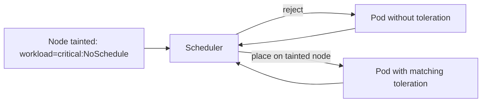
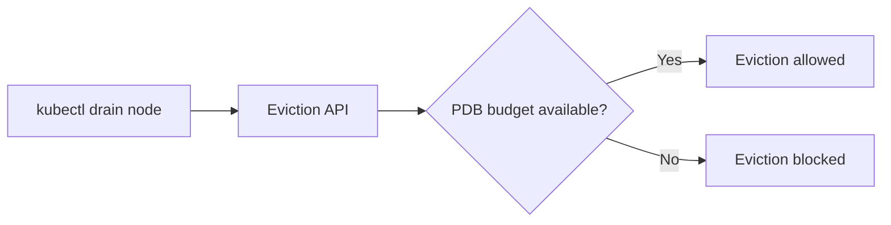
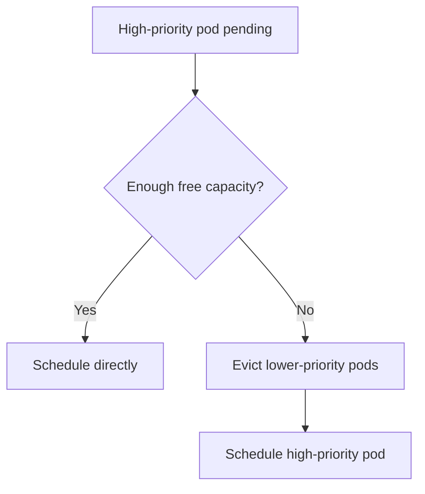
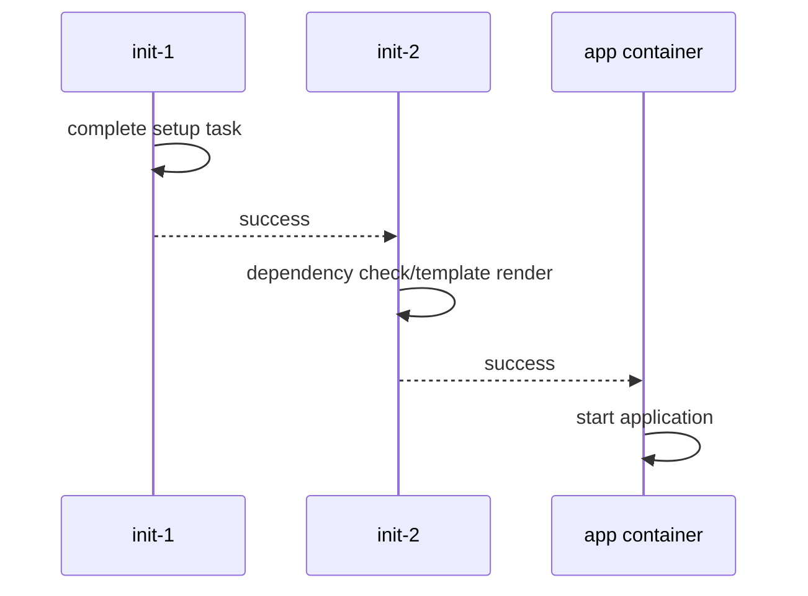
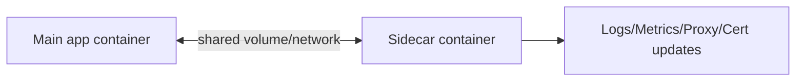

# Kubernetes Advanced Scheduling and Runtime Patterns (Stage 6)

## Why this name?
You asked for a better topic name. Instead of only “Advanced Workload Patterns”, this guide is named:

**Advanced Scheduling and Runtime Patterns**

Because these topics split into:
- **Scheduling controls** (where pods run): taints, tolerations, affinity, priority
- **Runtime behavior controls** (how pods start/operate): init containers, sidecars
- **Availability safeguards** during operations: PDB

---

## Topics Covered
37. Taints and Tolerations
38. Node Affinity and Pod Affinity
39. Pod Disruption Budgets (PDB)
40. Priority Classes
41. Init Containers (advanced patterns)
42. Sidecar Containers

---

## 37) Taints and Tolerations

### What it does
- **Taint** is applied on a node to repel pods.
- **Toleration** is applied on a pod to allow scheduling onto tainted nodes.

Taints control node admission from the node side.



### Taint effects
| Effect | Meaning |
|---|---|
| `NoSchedule` | New pods without toleration are not scheduled |
| `PreferNoSchedule` | Soft avoid preference |
| `NoExecute` | Evicts running pods without toleration and blocks new ones |

### Working example

```bash
# 1) Taint one node
NODE=$(kubectl get nodes -o jsonpath='{.items[0].metadata.name}')
kubectl taint nodes $NODE workload=critical:NoSchedule

# 2) Pod without toleration (will stay Pending)
kubectl apply -f - <<EOF
apiVersion: v1
kind: Pod
metadata:
  name: no-toleration
spec:
  containers:
    - name: app
      image: busybox
      command: ["sh","-c","sleep 3600"]
EOF

# 3) Pod with matching toleration (can schedule)
kubectl apply -f - <<EOF
apiVersion: v1
kind: Pod
metadata:
  name: with-toleration
spec:
  tolerations:
    - key: "workload"
      operator: "Equal"
      value: "critical"
      effect: "NoSchedule"
  containers:
    - name: app
      image: busybox
      command: ["sh","-c","sleep 3600"]
EOF

kubectl get pods -o wide
```

---

## 38) Node Affinity and Pod Affinity

### What it does
Affinity is label-based placement control from the pod side.

- **Node Affinity**: choose nodes by node labels
- **Pod Affinity**: co-locate near other pods
- **Pod Anti-Affinity**: spread away from other pods

```mermaid
flowchart TD
    POD[Incoming Pod] --> A{Node Affinity rules match?}
    A -->|No|requiredDuringScheduling => unschedulable[Pending]
    A -->|Yes| B{Pod Affinity / Anti-Affinity constraints match?}
    B -->|No|required constraints => pending2[Pending]
    B -->|Yes| S[Scheduled]
```

### Working example: Node Affinity

```bash
# Label a node
NODE=$(kubectl get nodes -o jsonpath='{.items[0].metadata.name}')
kubectl label node $NODE disktype=ssd --overwrite

# Pod requiring disktype=ssd
kubectl apply -f - <<EOF
apiVersion: v1
kind: Pod
metadata:
  name: affinity-pod
spec:
  affinity:
    nodeAffinity:
      requiredDuringSchedulingIgnoredDuringExecution:
        nodeSelectorTerms:
          - matchExpressions:
              - key: disktype
                operator: In
                values: ["ssd"]
  containers:
    - name: app
      image: busybox
      command: ["sh","-c","sleep 3600"]
EOF

kubectl get pod affinity-pod -o wide
```

### Working example: Pod Anti-Affinity (spread replicas)

```yaml
apiVersion: apps/v1
kind: Deployment
metadata:
  name: api-spread
spec:
  replicas: 3
  selector:
    matchLabels:
      app: api-spread
  template:
    metadata:
      labels:
        app: api-spread
    spec:
      affinity:
        podAntiAffinity:
          requiredDuringSchedulingIgnoredDuringExecution:
            - labelSelector:
                matchExpressions:
                  - key: app
                    operator: In
                    values: ["api-spread"]
              topologyKey: kubernetes.io/hostname
      containers:
        - name: app
          image: nginx:1.25
```

---

## 39) Pod Disruption Budgets (PDB)

### What it does
PDB limits **voluntary disruptions** (drain, rollout, cluster upgrades) so availability is preserved.

It does **not** protect against involuntary failures (node crash, OOM, hardware fault).



### Working example

Deployment:
```yaml
apiVersion: apps/v1
kind: Deployment
metadata:
  name: web
spec:
  replicas: 4
  selector:
    matchLabels:
      app: web
  template:
    metadata:
      labels:
        app: web
    spec:
      containers:
        - name: web
          image: nginx:1.25
```

PDB:
```yaml
apiVersion: policy/v1
kind: PodDisruptionBudget
metadata:
  name: web-pdb
spec:
  minAvailable: 3
  selector:
    matchLabels:
      app: web
```

Test:
```bash
kubectl apply -f web-deploy.yaml
kubectl apply -f web-pdb.yaml
kubectl get pdb
```

With 4 replicas and `minAvailable: 3`, only 1 pod can be voluntarily disrupted at a time.

---

## 40) Priority Classes

### What it does
PriorityClass influences scheduling and preemption under resource pressure.

Higher priority pods can preempt lower priority pods if needed.



### Working example

PriorityClass:
```yaml
apiVersion: scheduling.k8s.io/v1
kind: PriorityClass
metadata:
  name: critical-priority
value: 100000
preemptionPolicy: PreemptLowerPriority
globalDefault: false
description: "Critical workloads"
```

Pods:
```yaml
apiVersion: v1
kind: Pod
metadata:
  name: high-priority-pod
spec:
  priorityClassName: critical-priority
  containers:
    - name: app
      image: busybox
      command: ["sh","-c","sleep 3600"]
```

Low-priority pods can omit `priorityClassName` (default priority 0).

---

## 41) Init Containers (Advanced)

### What it does
Init containers run before main containers, sequentially, and must finish successfully.

Advanced use cases:
- dependency readiness gate
- config templating
- schema migration
- secret material preparation



### Working example: DB wait + config render

```yaml
apiVersion: v1
kind: Pod
metadata:
  name: init-advanced
spec:
  initContainers:
    - name: wait-db
      image: busybox
      command: ["sh","-c","until nc -z postgres 5432; do echo waiting; sleep 2; done"]
    - name: render-config
      image: busybox
      command: ["sh","-c","echo 'mode=prod' > /work/app.conf"]
      volumeMounts:
        - name: workdir
          mountPath: /work
  containers:
    - name: app
      image: busybox
      command: ["sh","-c","cat /work/app.conf && sleep 3600"]
      volumeMounts:
        - name: workdir
          mountPath: /work
  volumes:
    - name: workdir
      emptyDir: {}
```

---

## 42) Sidecar Containers

### What it does
Sidecar is a helper container running in the same pod as main app.

Common patterns:
- log shipping
- service proxy (Envoy)
- cert rotation agent
- config reload sidecar



### Working example: log sidecar

```yaml
apiVersion: v1
kind: Pod
metadata:
  name: sidecar-logging
spec:
  containers:
    - name: app
      image: busybox
      command: ["sh","-c","while true; do date >> /var/log/app.log; sleep 2; done"]
      volumeMounts:
        - name: logs
          mountPath: /var/log
    - name: sidecar
      image: busybox
      command: ["sh","-c","tail -F /var/log/app.log"]
      volumeMounts:
        - name: logs
          mountPath: /var/log
  volumes:
    - name: logs
      emptyDir: {}
```

Test:
```bash
kubectl apply -f sidecar-logging.yaml
kubectl logs sidecar-logging -c sidecar -f
```

---

## End-to-End Example (Combined Patterns)

This example combines tolerations + affinity + priority + init + sidecar.

```yaml
apiVersion: scheduling.k8s.io/v1
kind: PriorityClass
metadata:
  name: app-high
value: 10000
preemptionPolicy: PreemptLowerPriority
globalDefault: false
description: "Important app workload"
---
apiVersion: apps/v1
kind: Deployment
metadata:
  name: advanced-app
spec:
  replicas: 2
  selector:
    matchLabels:
      app: advanced-app
  template:
    metadata:
      labels:
        app: advanced-app
    spec:
      priorityClassName: app-high
      tolerations:
        - key: "workload"
          operator: "Equal"
          value: "critical"
          effect: "NoSchedule"
      affinity:
        nodeAffinity:
          preferredDuringSchedulingIgnoredDuringExecution:
            - weight: 50
              preference:
                matchExpressions:
                  - key: disktype
                    operator: In
                    values: ["ssd"]
        podAntiAffinity:
          preferredDuringSchedulingIgnoredDuringExecution:
            - weight: 100
              podAffinityTerm:
                labelSelector:
                  matchExpressions:
                    - key: app
                      operator: In
                      values: ["advanced-app"]
                topologyKey: kubernetes.io/hostname
      initContainers:
        - name: init
          image: busybox
          command: ["sh","-c","echo ready > /work/boot.txt"]
          volumeMounts:
            - name: work
              mountPath: /work
      containers:
        - name: app
          image: busybox
          command: ["sh","-c","cat /work/boot.txt; while true; do echo app >> /work/app.log; sleep 5; done"]
          volumeMounts:
            - name: work
              mountPath: /work
        - name: log-sidecar
          image: busybox
          command: ["sh","-c","tail -F /work/app.log"]
          volumeMounts:
            - name: work
              mountPath: /work
      volumes:
        - name: work
          emptyDir: {}
---
apiVersion: policy/v1
kind: PodDisruptionBudget
metadata:
  name: advanced-app-pdb
spec:
  minAvailable: 1
  selector:
    matchLabels:
      app: advanced-app
```

---

## Verification Commands

```bash
# Taints / tolerations
kubectl describe node <node-name> | grep -i Taints -A2
kubectl describe pod with-toleration | grep -i Tolerations -A5

# Affinity
kubectl get pod affinity-pod -o wide
kubectl describe pod affinity-pod | grep -i -A8 Affinity

# PDB
kubectl get pdb
kubectl describe pdb web-pdb

# Priority
kubectl get priorityclass
kubectl describe pod high-priority-pod | grep -i -A3 Priority

# Init containers
kubectl describe pod init-advanced | grep -i -A12 "Init Containers"

# Sidecar
kubectl get pod sidecar-logging
kubectl logs sidecar-logging -c sidecar --tail=20
```

---

## Summary

| Topic | Expert takeaway |
|---|---|
| Taints/Tolerations | Node-level admission control for isolation and dedicated capacity |
| Affinity/Anti-affinity | Label-driven placement with hard/soft scheduling semantics |
| PDB | Protects app availability during voluntary disruptions |
| PriorityClass | Controls scheduling precedence and preemption under contention |
| Init containers | Deterministic startup pipeline for dependency and setup tasks |
| Sidecars | Co-located helper runtime for logs/proxy/certs/config-reload patterns |
