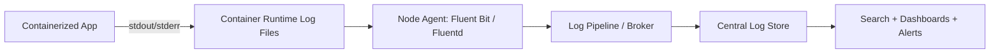
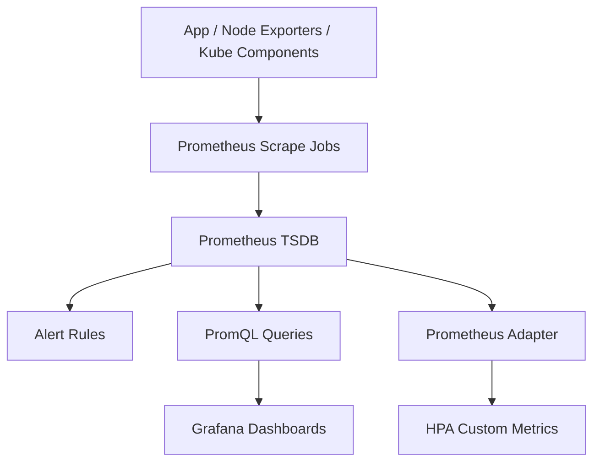
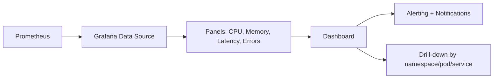
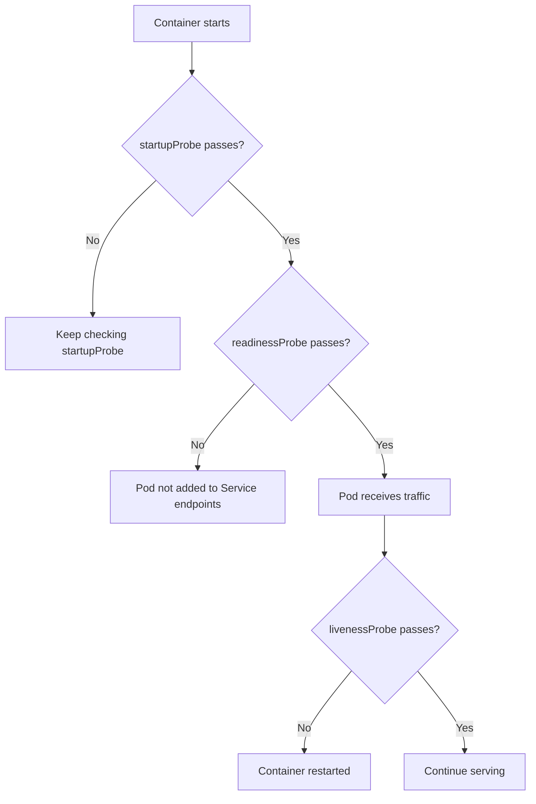
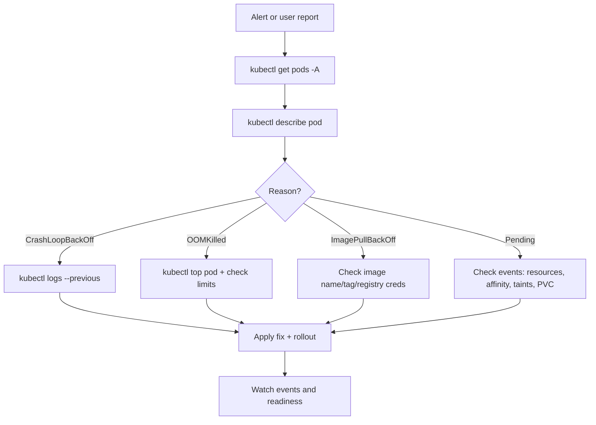

# Kubernetes Observability (Stage 6)

## Topics Covered
32. Logging architecture
33. Metrics with Prometheus
34. Dashboards with Grafana
35. Liveness, readiness, startup probes
36. Events and debugging

---

## 32) Logging Architecture

### What to learn
- Why apps should write logs to `stdout/stderr`
- Node-level log collection with Fluent Bit / Fluentd
- Central log storage and querying patterns
- Structured logging and correlation best practices

### Standard Kubernetes logging flow



### Why stdout/stderr first
- Portable across platforms
- Works with any runtime collector
- No sidecar required for basic cases
- Supports immutable container patterns

### Working example app log producer

```yaml
apiVersion: v1
kind: Pod
metadata:
  name: log-demo
  namespace: app
spec:
  containers:
    - name: app
      image: busybox
      command:
        - sh
        - -c
        - |
          i=0
          while true; do
            echo "$(date -Iseconds) level=info service=log-demo msg='heartbeat' count=$i"
            i=$((i+1))
            sleep 2
          done
```

### Useful commands
```bash
kubectl logs log-demo -n app --tail=50
kubectl logs log-demo -n app -f
```

### Expert notes
- Prefer JSON/structured logs (`timestamp`, `level`, `service`, `trace_id`, `span_id`).
- Keep retention by tier: short hot storage + long cold archive.
- Avoid multiline ambiguity by emitting one event per line when possible.
- Set sampling/filters early to control cost explosion.

---

## 33) Metrics with Prometheus

### What to learn
- Pull-based scraping model
- `metrics-server` vs Prometheus (different purposes)
- ServiceMonitor/PodMonitor concepts
- Custom metrics for autoscaling

### Metrics pipeline workflow



### `metrics-server` vs Prometheus

| Tool | Purpose |
|---|---|
| `metrics-server` | lightweight CPU/memory metrics for HPA and `kubectl top` |
| Prometheus | full time-series monitoring, alerting, long-term observability |

### Working example: app exposing `/metrics`

```yaml
apiVersion: apps/v1
kind: Deployment
metadata:
  name: metrics-demo
  namespace: app
spec:
  replicas: 1
  selector:
    matchLabels:
      app: metrics-demo
  template:
    metadata:
      labels:
        app: metrics-demo
      annotations:
        prometheus.io/scrape: "true"
        prometheus.io/port: "8080"
        prometheus.io/path: "/metrics"
    spec:
      containers:
        - name: app
          image: quay.io/brancz/prometheus-example-app:v0.5.0
          ports:
            - containerPort: 8080
```

### Verify basics
```bash
kubectl top pods -n app
kubectl get pods -n app --show-labels
```

### Expert notes
- Design recording rules for expensive PromQL queries.
- Use label hygiene (`service`, `namespace`, `cluster`) to avoid cardinality blowups.
- Keep high-cardinality labels (user IDs, request IDs) out of metrics.

---

## 34) Dashboards with Grafana

### What to learn
- How Grafana uses Prometheus as data source
- Building dashboards for cluster + app SLO views
- Variables, templating, drill-down workflows

### Grafana dashboard workflow



### Minimum useful dashboard layout
1. **Golden signals**: latency, traffic, errors, saturation
2. **Kubernetes health**: pod restarts, pending pods, node pressure
3. **Capacity**: CPU/memory requests vs usage
4. **Reliability**: 5xx rate, p95/p99 latency

### Example PromQL snippets
```promql
# Pod restarts (5m)
sum(increase(kube_pod_container_status_restarts_total[5m])) by (namespace, pod)

# CPU usage per pod
sum(rate(container_cpu_usage_seconds_total{container!=""}[5m])) by (namespace, pod)

# Memory working set per pod
sum(container_memory_working_set_bytes{container!=""}) by (namespace, pod)
```

### Expert notes
- Build role-based dashboards: platform, service owner, incident commander.
- Keep panel query latency low for incident usability.
- Add links from panels to logs and traces for fast triage.

---

## 35) Liveness, Readiness, Startup Probes

### What to learn
- Different probe purposes and failure effects
- Traffic gating with readiness
- Startup protection for slow apps

### Probe decision workflow



### Working example with all probes

```yaml
apiVersion: apps/v1
kind: Deployment
metadata:
  name: probe-demo
  namespace: app
spec:
  replicas: 2
  selector:
    matchLabels:
      app: probe-demo
  template:
    metadata:
      labels:
        app: probe-demo
    spec:
      containers:
        - name: app
          image: nginx:1.25
          ports:
            - containerPort: 80
          startupProbe:
            httpGet:
              path: /
              port: 80
            failureThreshold: 30
            periodSeconds: 2
          readinessProbe:
            httpGet:
              path: /
              port: 80
            periodSeconds: 5
            timeoutSeconds: 2
          livenessProbe:
            httpGet:
              path: /
              port: 80
            periodSeconds: 10
            timeoutSeconds: 2
```

### Expert notes
- Use `startupProbe` for JVM/.NET/large app cold starts.
- Readiness should reflect downstream dependencies where required.
- Liveness should detect deadlock, not transient slowness.

---

## 36) Events and Debugging

### What to learn
- Fast triage using `events`, `describe`, `logs`, `top`
- Diagnosing `OOMKilled`, `CrashLoopBackOff`, `ImagePullBackOff`
- Building repeatable debug flow

### Incident debug workflow



### Core debug commands
```bash
kubectl get events -A --sort-by=.lastTimestamp
kubectl describe pod <pod> -n <ns>
kubectl logs <pod> -n <ns> --previous
kubectl top pod <pod> -n <ns>
kubectl get pod <pod> -n <ns> -o yaml
```

### Common failure patterns

| Symptom | Typical cause | First action |
|---|---|---|
| `CrashLoopBackOff` | app crash, bad config, failed dependency | inspect previous logs + describe events |
| `OOMKilled` | memory limit too low | increase limit/request, inspect heap usage |
| `ImagePullBackOff` | wrong image/tag or auth | verify image ref + pull secret |
| `Pending` | no schedulable node / PVC pending | check scheduler events and PVC status |

### Expert notes
- Capture pod `lastState` and exit codes before restarting evidence disappears.
- Build runbooks by error class (OOM, probe fail, scheduling, image pull).
- Use ephemeral debug containers for live inspection in production-safe manner.

---

## End-to-End Observability Example (Works Together)

```mermaid
flowchart LR
    APP[Application Pod] --> LOG[stdout/stderr logs]
    APP --> METRICS[/metrics endpoint]
    APP --> PROBES[health probe endpoints]

    LOG --> COLLECT[Fluent Bit/Fluentd]
    COLLECT --> LOGSTORE[Central Logs]

    METRICS --> PROM[Prometheus]
    PROM --> GRAF[Grafana]
    PROM --> ALERT[Alertmanager]

    PROBES --> KUBELET[kubelet decisions]
    KUBELET --> EVENTS[Kubernetes Events]
    EVENTS --> DEBUG[Debug workflow]
```

---

## Quick Lab (Minimal)

```bash
# 1) create namespace
kubectl create ns app

# 2) deploy probe-demo + metrics-demo + log-demo
kubectl apply -n app -f probe-demo.yaml
kubectl apply -n app -f metrics-demo.yaml
kubectl apply -n app -f log-demo.yaml

# 3) observe
kubectl get pods -n app
kubectl logs -n app log-demo --tail=20
kubectl get events -n app --sort-by=.lastTimestamp
kubectl top pods -n app
```

---

## Summary

| Topic | Key takeaway |
|---|---|
| Logging architecture | stdout/stderr + node agents + central store is the standard pipeline |
| Metrics with Prometheus | scrape-driven time-series + PromQL + alerting powers SRE operations |
| Dashboards with Grafana | visualize SLOs and drill-down from cluster to service to pod |
| Probes | startup/readiness/liveness control lifecycle, traffic, and restart behavior |
| Events and debugging | repeatable CLI-first triage flow reduces MTTR significantly |
