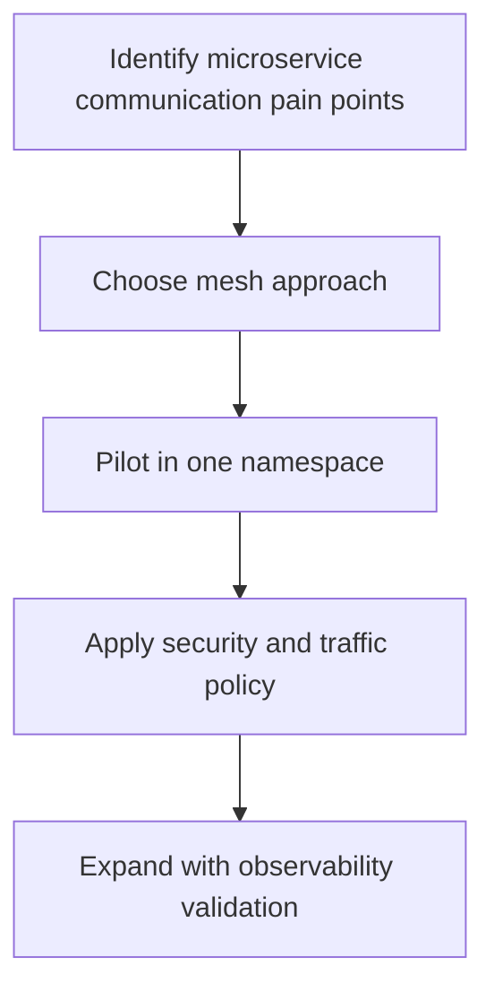
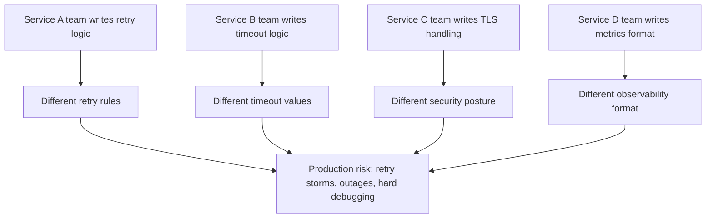
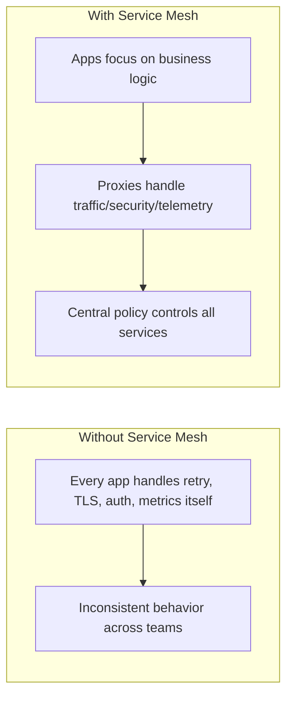
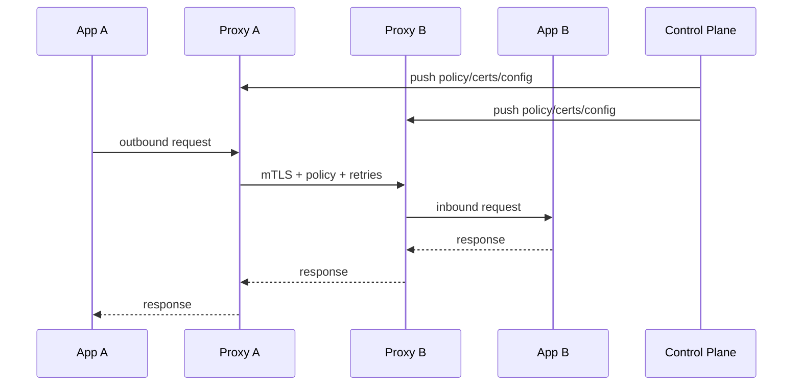
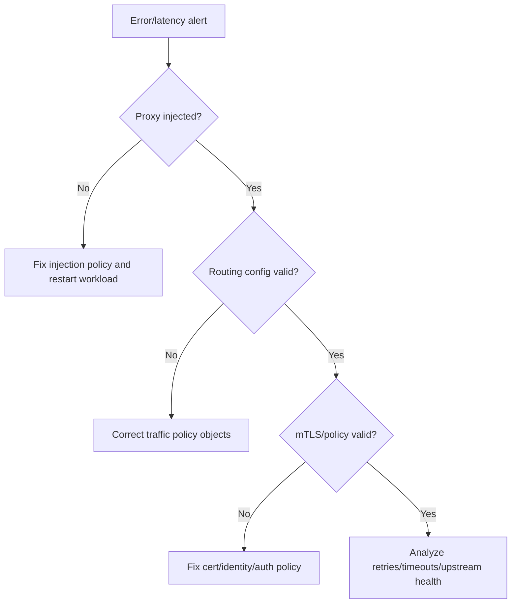

# Kubernetes Service Mesh (Istio and Linkerd) (Stage 7)

## What is it?
A service mesh is an infrastructure layer for service-to-service communication that provides policy, security, and traffic management without embedding all logic in each application.

## What is it used for?
- mTLS between services
- Consistent retries/timeouts and traffic splitting
- Better service-level telemetry and governance

## Why is it important?
It standardizes cross-cutting communication concerns and reduces application-level networking complexity.

## Workflow


## Topics Covered
43. What a service mesh solves
44. Data plane vs control plane
45. Istio fundamentals and core resources
46. Linkerd fundamentals and core resources
47. Istio vs Linkerd comparison
48. Minimal labs and troubleshooting

---

## 43) What a Service Mesh Solves

### Simple problem statement (for beginners)
As soon as you move from 2-3 services to many microservices, every service needs to implement the same network concerns:
- retries and timeouts
- TLS/mTLS and certificate handling
- service-to-service authorization
- metrics, traces, and request visibility

If each team implements these in its own code, behavior becomes inconsistent and hard to operate.

### Why this becomes painful without mesh



### What service mesh changes
A **service mesh** moves cross-cutting network logic out of app code and into proxies + central policy.

```mermaid
flowchart LR
    subgraph App Layer
      A[Service A Pod]
      B[Service B Pod]
    end

    subgraph Mesh Data Plane
      PA[Proxy A]
      PB[Proxy B]
    end

    CP[Mesh Control Plane\n(policy + identity + certs)] --> PA
    CP --> PB

    A --> PA
    PA --> PB
    PB --> B
```

### Before vs After (mental model)



### Concrete reasons we need it

| Need | Without mesh | With mesh |
|---|---|---|
| Secure service calls | Each app must implement mTLS/auth | Mesh provides mTLS identity and policy |
| Safe rollout | Canary logic coded per app | Weighted routing via mesh policy |
| Failure handling | Retry/timeout behavior differs by service | Standardized retries/timeouts/circuit-breaking |
| Debugging | Logs/metrics not correlated | Consistent telemetry for all service calls |
| Platform governance | Hard to enforce org-wide rules | Central policy and auditable config |

### When you should strongly consider a mesh
- You have many services and frequent inter-service calls.
- Security requires encryption and identity between internal services.
- You do progressive delivery (canary/blue-green) regularly.
- Incidents are hard to debug due to missing request visibility.

---

## 44) Data Plane vs Control Plane

| Layer | Responsibility |
|---|---|
| Data plane | Proxies that handle live service traffic |
| Control plane | Distributes policy, certs, and routing config |

### Request lifecycle



### Deployment models
- **Sidecar mode**: proxy next to every pod (most common)
- **Sidecarless/Ambient (Istio)**: split dataplane components, lower sidecar overhead

---

## 45) Istio Fundamentals and Core Resources

### Architecture summary
- Data plane: Envoy proxies (sidecar or ambient data plane)
- Control plane: `istiod`
- Policy/security/routing defined via CRDs

### Core Istio resources

| Resource | Purpose |
|---|---|
| `Gateway` | Ingress/egress traffic entry point |
| `VirtualService` | L7 routing rules (path/header/weight) |
| `DestinationRule` | subsets, load balancing, TLS settings |
| `PeerAuthentication` | mTLS mode (`STRICT`, `PERMISSIVE`) |
| `AuthorizationPolicy` | service-to-service access control |

### Minimal canary example (Istio)

```yaml
apiVersion: networking.istio.io/v1beta1
kind: VirtualService
metadata:
  name: reviews
  namespace: app
spec:
  hosts:
    - reviews
  http:
    - route:
        - destination:
            host: reviews
            subset: v1
          weight: 90
        - destination:
            host: reviews
            subset: v2
          weight: 10
---
apiVersion: networking.istio.io/v1beta1
kind: DestinationRule
metadata:
  name: reviews
  namespace: app
spec:
  host: reviews
  subsets:
    - name: v1
      labels:
        version: v1
    - name: v2
      labels:
        version: v2
```

### Enforce strict mTLS (Istio)

```yaml
apiVersion: security.istio.io/v1beta1
kind: PeerAuthentication
metadata:
  name: default
  namespace: app
spec:
  mtls:
    mode: STRICT
```

### Useful checks
```bash
istioctl proxy-status
kubectl get virtualservice,destinationrule -n app
kubectl get peerauthentication,authorizationpolicy -n app
```

---

## 46) Linkerd Fundamentals and Core Resources

### Architecture summary
- Data plane: lightweight Rust proxy (`linkerd2-proxy`)
- Control plane: identity, destination, policy components
- Strong default mTLS and simple operations model

### Core Linkerd workflows
- Install control plane
- Inject proxies (`linkerd inject` or auto-inject)
- Verify health (`linkerd check`)
- Observe traffic (`linkerd viz`)

### Typical Linkerd commands
```bash
linkerd check
linkerd inject deploy.yaml | kubectl apply -f -
linkerd -n app viz stat deploy
linkerd -n app viz top deploy
```

### Split traffic example (Linkerd SMI style)

```yaml
apiVersion: split.smi-spec.io/v1alpha3
kind: TrafficSplit
metadata:
  name: reviews-split
  namespace: app
spec:
  service: reviews
  backends:
    - service: reviews-v1
      weight: 90
    - service: reviews-v2
      weight: 10
```

### Linkerd service profile concept
- Route-level success latency metrics
- Retry budgets and timeouts per route
- Better golden-signal visibility by endpoint behavior

---

## 47) Istio vs Linkerd Comparison

| Dimension | Istio | Linkerd |
|---|---|---|
| Feature depth | Very broad (advanced L7, policy, gateways, ambient) | Focused, simpler core mesh features |
| Operational complexity | Higher learning/ops overhead | Lower overhead, easier day-1 adoption |
| Proxy | Envoy | linkerd2-proxy |
| Policy model | Rich and flexible CRDs | Opinionated and straightforward |
| Best fit | Large platform teams, complex traffic/security requirements | Teams wanting fast, low-friction service mesh adoption |

### Practical decision guide
- Choose **Istio** when you need advanced routing/policy controls, multi-cluster complexity, or deep customization.
- Choose **Linkerd** when you prioritize simplicity, low footprint, and quick operational success.

---

## 48) Minimal Labs and Troubleshooting

## Lab A: Validate mTLS posture
```bash
# Istio
kubectl get peerauthentication -A

# Linkerd
linkerd -n app viz stat deploy
```

## Lab B: Canary rollout
1. Deploy `v1` and `v2` of one service.
2. Apply weighted policy (Istio `VirtualService` or Linkerd `TrafficSplit`).
3. Send traffic and watch success rate/latency before increasing weight.

## Common issues

| Symptom | Likely cause | First check |
|---|---|---|
| Traffic bypasses mesh | sidecar/proxy not injected | verify pod annotations/containers |
| 503 errors after policy change | bad route or subset labels | verify `VirtualService`/`DestinationRule` or `TrafficSplit` targets |
| mTLS handshake failures | identity/cert mismatch | inspect mesh control plane health |
| High latency | retry storm or wrong timeout | check retry budgets/timeouts/circuit-breaker config |

### Debug workflow



---

## Summary

| Topic | Key takeaway |
|---|---|
| Service mesh value | Moves traffic, security, and observability concerns out of app code |
| Istio | Powerful and flexible for advanced platform requirements |
| Linkerd | Lightweight and easier to operate for many teams |
| Choice strategy | Match mesh complexity to team maturity and workload needs |
