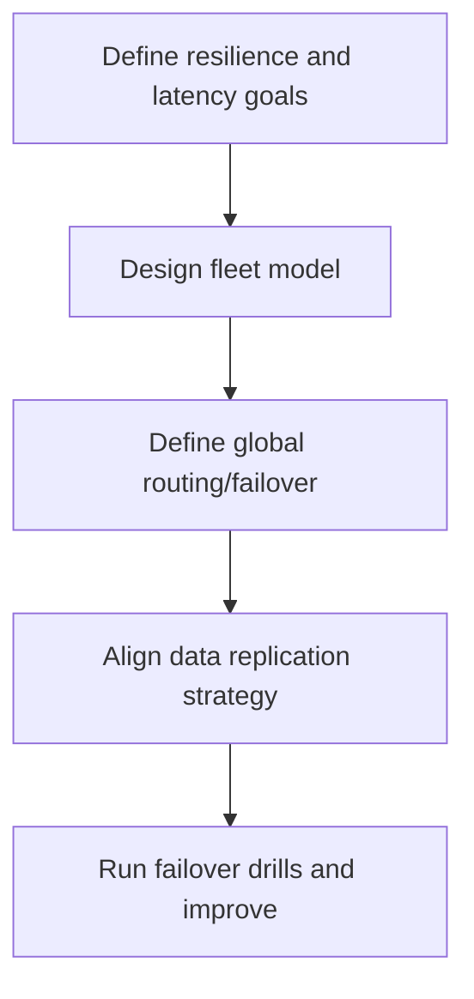
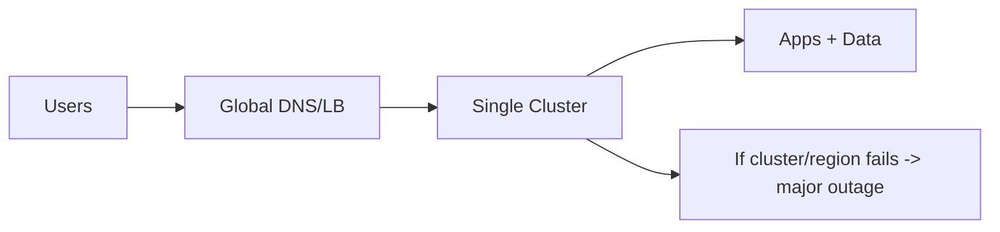
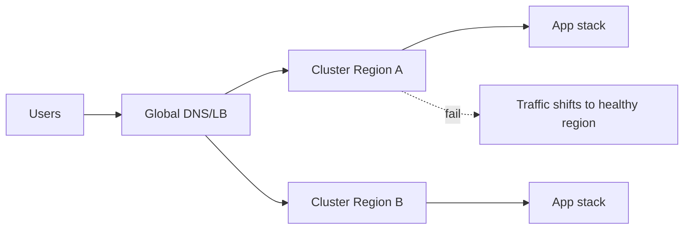
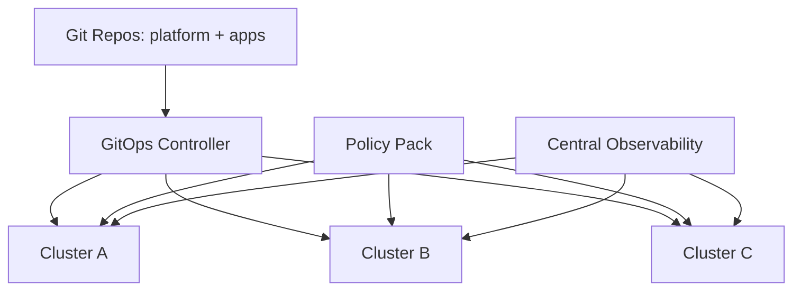
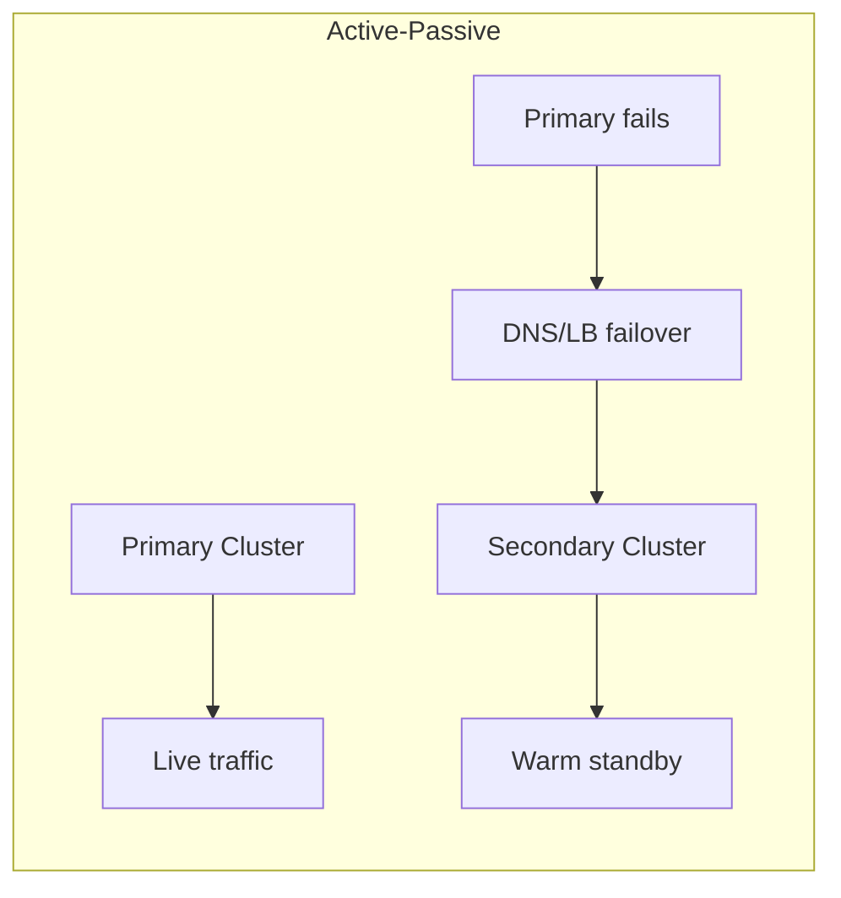
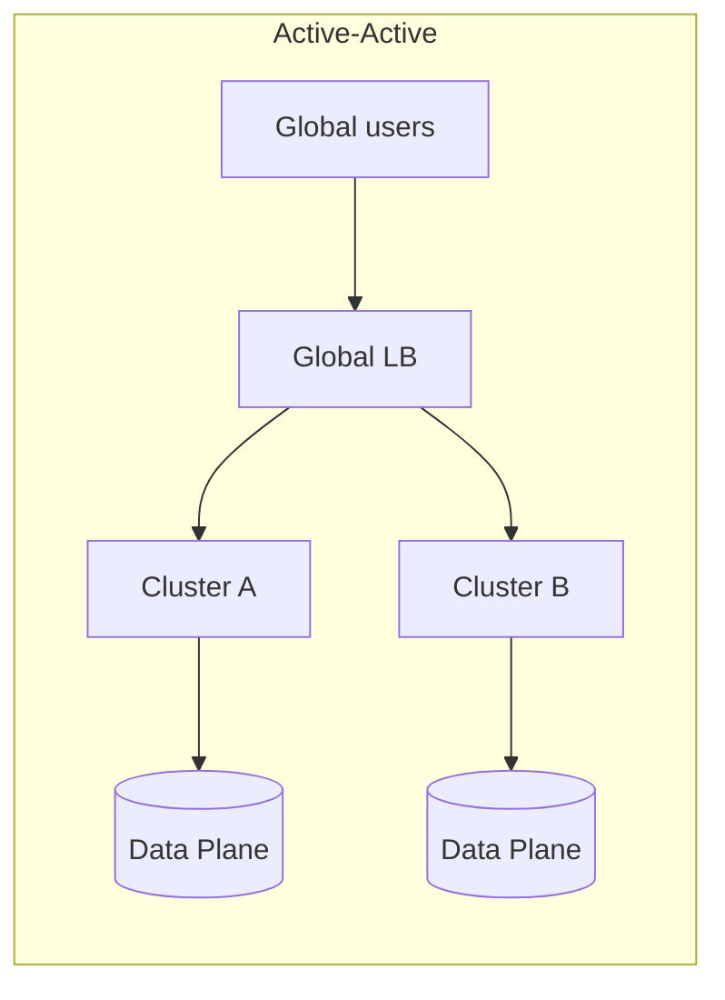
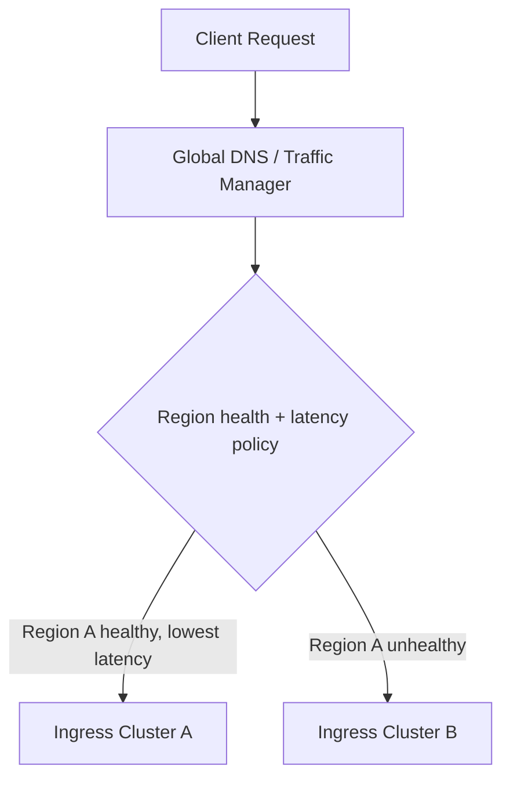
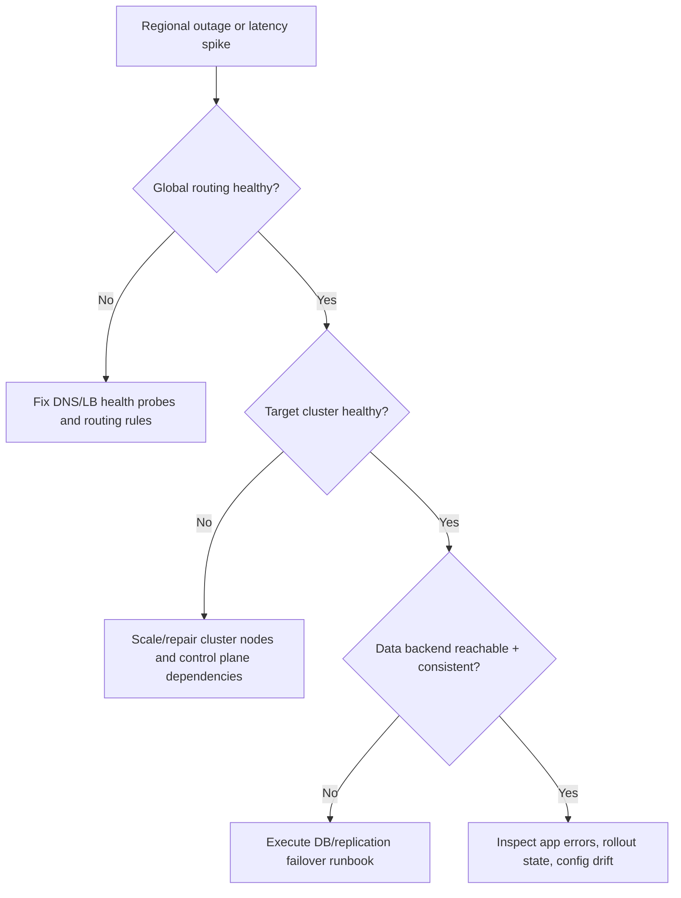

# Kubernetes Multi-Cluster Patterns (Stage 8)

## What is it?
Multi-cluster patterns describe how multiple Kubernetes clusters are organized and operated for resilience, isolation, and global delivery.

## What is it used for?
- Regional failover and disaster recovery
- Isolation by environment/team/compliance boundary
- Global traffic routing for latency and availability

## Why is it important?
A single cluster can become a single point of failure for large-scale systems.

## Workflow

## Topics Covered
49. Why multi-cluster
50. Fleet management model
51. Failover and disaster recovery patterns
52. Global traffic routing patterns
53. Data and state considerations
54. Operational checklist and troubleshooting

---

## 49) Why Multi-Cluster

A single cluster is often not enough for production at scale.

### Typical reasons
- Higher availability across regions
- Isolation by environment/tenant/compliance boundary
- Lower blast radius during incidents
- Better latency for global users

### Single-cluster risk vs multi-cluster resilience

---

## 50) Fleet Management Model

A **fleet** is a set of clusters managed with common policy, security, and delivery standards.

### Core fleet building blocks
- Central GitOps control for app definitions
- Shared policy baseline (OPA/Kyverno)
- Shared identity and secret strategy
- Per-cluster overrides for region/capacity

### Practical operating model
| Scope | Managed centrally | Managed per cluster |
|---|---|---|
| Security baseline | admission policies, image controls | exceptions for local constraints |
| App delivery | Helm/Kustomize templates | values overrides (region, node size) |
| Observability | common dashboards/alerts | local SLO thresholds if needed |
| Networking | global ingress strategy | cluster-local CNI/egress specifics |

---

## 51) Failover and Disaster Recovery Patterns

### Active-Passive
- Primary cluster serves all traffic
- Secondary cluster warm standby
- On failure, traffic switches to secondary

### Active-Active
- Multiple clusters serve traffic simultaneously
- Better latency and resilience
- Requires stronger data consistency strategy

### DR metrics to define
- **RTO**: maximum acceptable recovery time
- **RPO**: maximum acceptable data loss window

If app recovery takes 15 minutes, then $RTO = 15\ min$.

---

## 52) Global Traffic Routing Patterns

### Common strategies
- Geo routing: route users to nearest region
- Latency routing: route to lowest-latency region
- Weighted routing: gradual traffic shifts
- Failover routing: health-based fallback

### In-cluster + cross-cluster split
- Global layer decides **which cluster** gets traffic
- Cluster ingress/service mesh decides **which service version** gets traffic

---

## 53) Data and State Considerations

Multi-cluster app failover is easy for stateless workloads, harder for stateful systems.

### Data patterns
- Read replicas across regions
- Multi-master (careful with conflicts)
- Event replication / async sync
- Backup + restore fallback model

### Decision guidance
| Workload type | Recommended pattern |
|---|---|
| Stateless APIs | Active-active clusters |
| Session-heavy apps | External shared session/data store |
| Strong consistency DB | Active-passive for app tier + managed DB failover |
| Event-driven systems | Cross-region queue/topic replication |

---

## 54) Operational Checklist and Troubleshooting

### Readiness checklist
- Health probes and global health endpoints are reliable
- GitOps sync and policy checks are consistent across clusters
- Runbooks include region failover steps
- DR drills are tested quarterly

### Troubleshooting workflow

---

## Summary

| Topic | Key takeaway |
|---|---|
| Multi-cluster value | Improves resilience, isolation, and global performance |
| Fleet model | Central standards + local cluster overrides |
| Failover design | Choose active-passive or active-active based on RTO/RPO and data model |
| Global traffic | DNS/LB decides region, cluster ingress decides service path |
