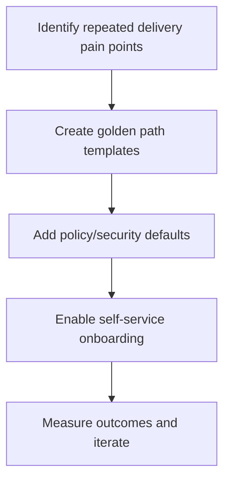
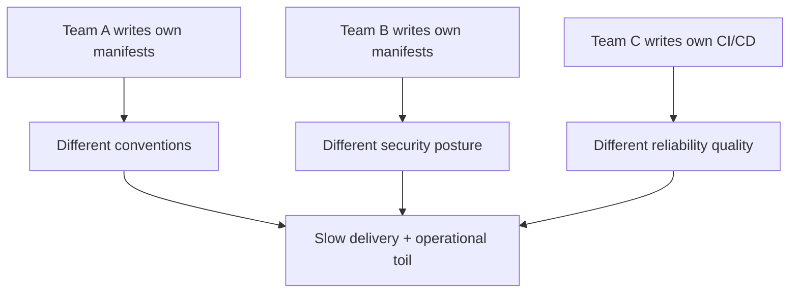
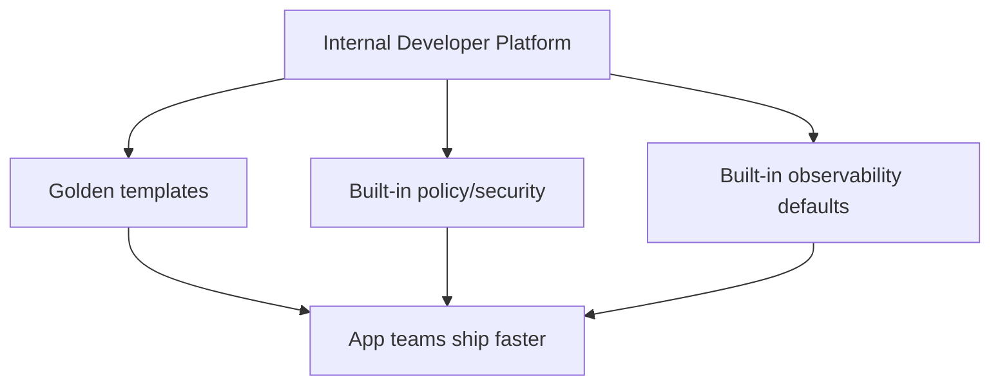
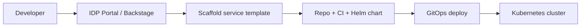
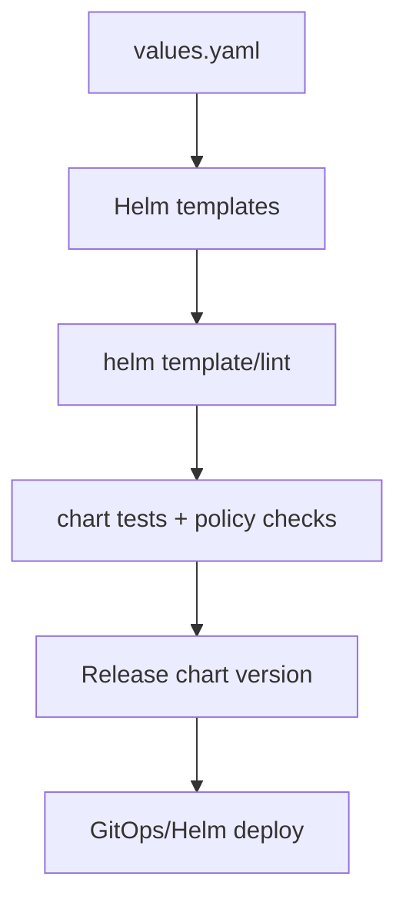
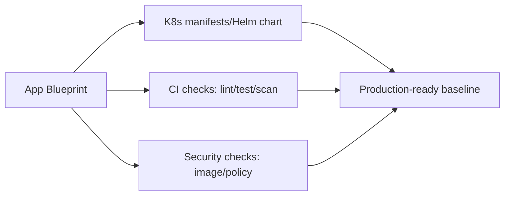
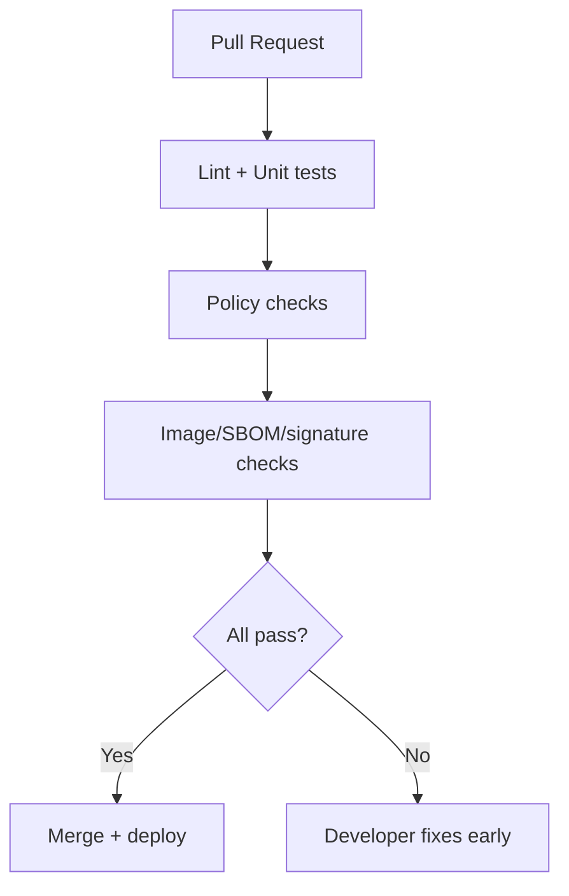
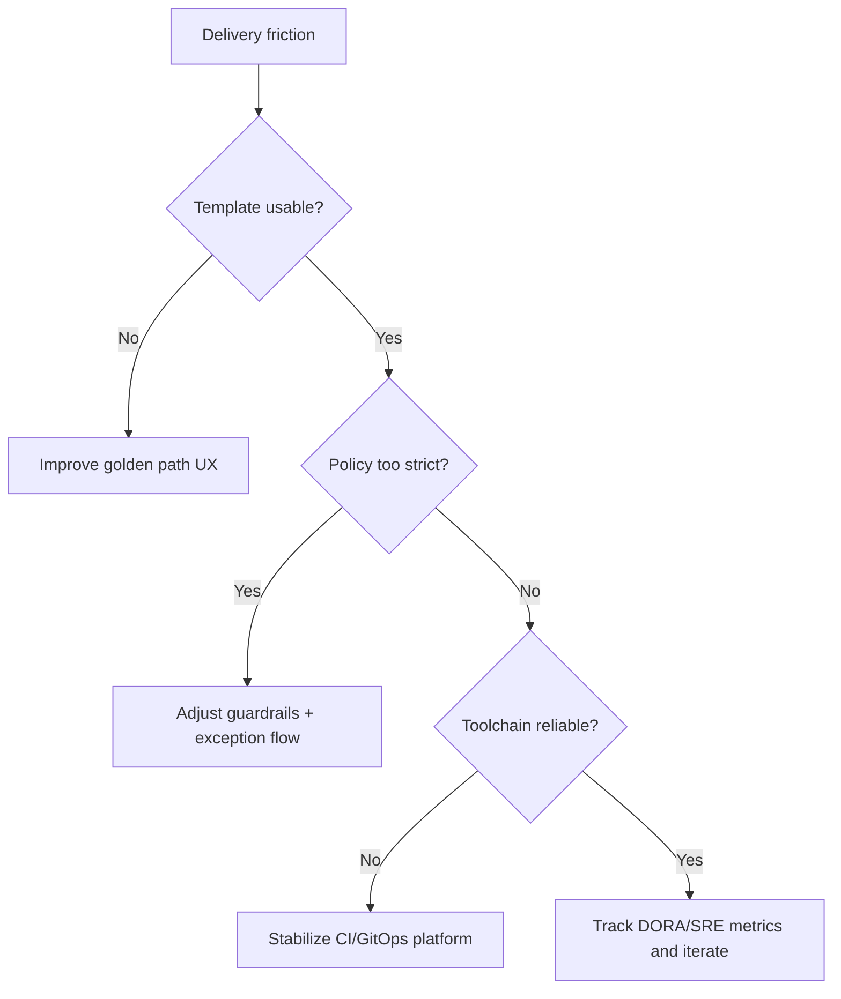

# Kubernetes Platform Engineering Basics (Stage 9)

## What is it?
Platform engineering in Kubernetes is the practice of creating reusable internal platform capabilities (templates, guardrails, automation) so product teams can ship safely and quickly.

## What is it used for?
- Golden paths and self-service deployment workflows
- Standardized Helm/app blueprints
- Policy and governance at scale with better developer experience

## Why is it important?
Without a platform approach, teams duplicate effort and delivery quality becomes inconsistent.

## Workflow


## Topics Covered
55. Why platform engineering in Kubernetes
56. Golden paths and internal developer platform (IDP)
57. Helm best practices
58. Standard delivery templates (app blueprint)
59. Governance, security, and developer experience
60. Adoption roadmap and troubleshooting

---

## 55) Why Platform Engineering in Kubernetes

As Kubernetes adoption grows, every team repeating the same setup leads to inconsistency and slow delivery.

Platform engineering builds reusable guardrails so app teams focus on business logic.

### Without platform engineering



### With platform engineering



---

## 56) Golden Paths and Internal Developer Platform (IDP)

### Golden path
A pre-approved way to build, deploy, and operate services.

Example golden path includes:
- service template (API, worker, cronjob)
- CI pipeline template
- Helm chart baseline
- default alerts, dashboards, and probes



### IDP core capabilities
| Capability | Why it matters |
|---|---|
| Self-service provisioning | Faster onboarding and fewer ticket bottlenecks |
| Standard templates | Consistent quality and security |
| Policy guardrails | Prevent risky configs early |
| Service catalog | Discoverability and ownership clarity |

---

## 57) Helm Best Practices

### Chart design principles
- Keep charts modular and small
- Put defaults in `values.yaml`
- Keep environment-specific values in separate files
- Avoid hardcoding namespace/image tags in templates

### Versioning and releases
- Use semantic versioning for charts
- Track app version separately (`appVersion`)
- Maintain release notes for breaking value changes

### Template hygiene checklist
- Use labels/annotations consistently
- Add readiness/liveness probes by default
- Provide resource requests/limits defaults
- Add PDB and HPA options as configurable blocks



### Example structure
```text
charts/my-service/
  Chart.yaml
  values.yaml
  values-dev.yaml
  values-prod.yaml
  templates/
    deployment.yaml
    service.yaml
    hpa.yaml
    pdb.yaml
```

---

## 58) Standard Delivery Templates (App Blueprint)

A good app blueprint should include:
- deployment/service/ingress
- probes and resource defaults
- autoscaling policy
- secret/config patterns
- SLO-based alert starter set



### Minimum production defaults
| Area | Default recommendation |
|---|---|
| Reliability | readiness/liveness/startup probes |
| Capacity | requests/limits + HPA profile |
| Security | non-root, drop capabilities, image policy |
| Operability | standard labels, metrics endpoint, logs format |

---

## 59) Governance, Security, and Developer Experience

Platform teams should balance guardrails and flexibility.

### Governance model
- Mandatory: baseline security and policy checks
- Flexible: resource sizing and non-critical app settings
- Escalation path: approved exceptions with expiry

### Shift-left controls
- Helm lint + schema validation
- Policy-as-code (Kyverno/OPA)
- Supply-chain checks (SBOM/signature)
- Pre-deploy cost estimation where possible



---

## 60) Adoption Roadmap and Troubleshooting

### 90-day practical roadmap
1. Identify top 3 repeated pain points (deployment, security, observability)
2. Build 1 golden path template for the most common service
3. Add CI policy checks and default Helm values
4. Onboard 2-3 pilot teams and collect feedback
5. Standardize scorecards (lead time, failure rate, MTTR)

### Troubleshooting platform adoption issues

| Symptom | Likely cause | First action |
|---|---|---|
| Teams bypass templates | templates too rigid or outdated | simplify and version templates |
| Frequent production drift | weak GitOps/policy enforcement | enforce sync and admission policies |
| Slow onboarding | poor docs/self-service UX | improve portal docs and starter examples |
| Alert noise | un-tuned defaults | refine SLO alerts by workload class |



---

## Summary

| Topic | Key takeaway |
|---|---|
| Platform engineering goal | Enable fast, safe, and consistent delivery at scale |
| Golden paths | Reduce cognitive load for app teams |
| Helm best practices | Create reusable, versioned, and policy-friendly deployments |
| IDP outcomes | Better developer experience with stronger governance |
