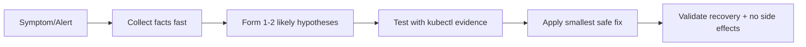
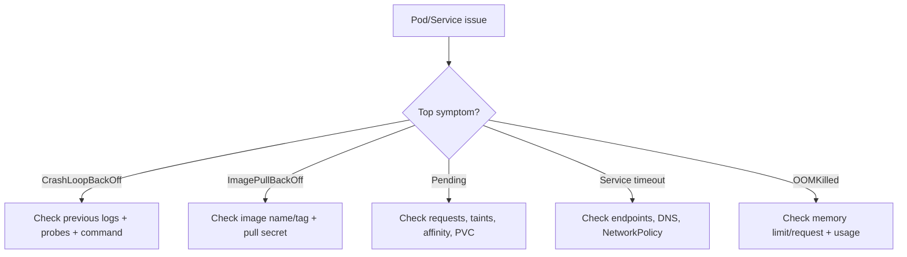
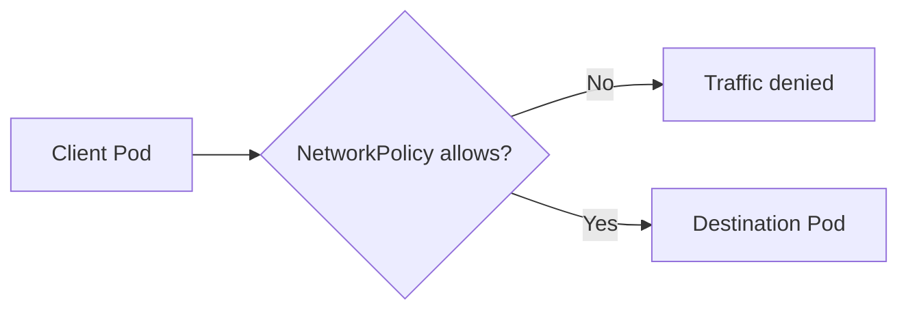
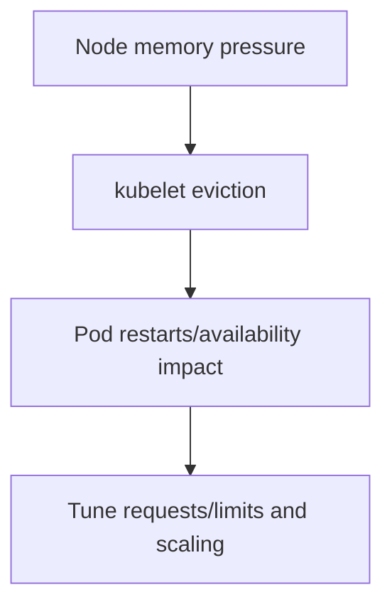
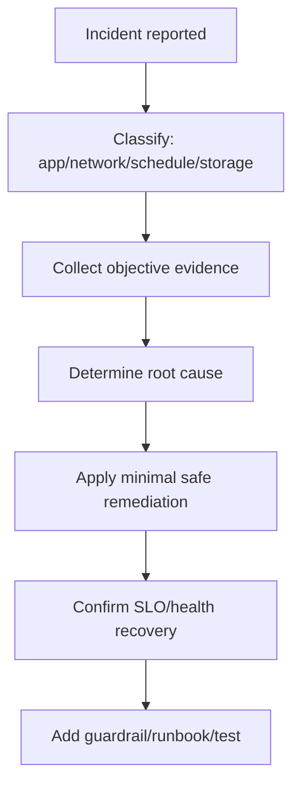

# Kubernetes Troubleshooting Drills (Stage 10)

## Topics Covered
61. Incident-first troubleshooting mindset
62. Fast triage workflow (the 5-minute method)
63. Drill set A: Pod lifecycle incidents
64. Drill set B: Networking and service discovery incidents
65. Drill set C: Scheduling, storage, and node incidents
66. Exam-style practice loop and runbook template

---

## 61) Incident-First Troubleshooting Mindset

CKA/CKAD troubleshooting is about **speed + correctness**:
- identify symptom quickly
- narrow blast radius
- find root cause with evidence
- apply minimal safe fix
- verify recovery

### Core principle
Do not guess. Follow a repeatable workflow.



---

## 62) Fast Triage Workflow (The 5-Minute Method)

### Step 1: What is broken?
```bash
kubectl get pods -A
kubectl get events -A --sort-by=.lastTimestamp
```

### Step 2: Where is it broken?
```bash
kubectl describe pod <pod> -n <ns>
kubectl logs <pod> -n <ns> --previous
```

### Step 3: Why is it broken?
Check for common categories:
- image pull/auth issues
- probe failures
- resource pressure (`OOMKilled`, CPU throttling)
- scheduling constraints
- DNS/service connectivity

### Step 4: Apply fix and verify
```bash
kubectl rollout restart deploy/<name> -n <ns>
kubectl rollout status deploy/<name> -n <ns>
kubectl get pods -n <ns> -w
```

### Triage decision tree



---

## 63) Drill Set A: Pod Lifecycle Incidents

## Drill A1: `CrashLoopBackOff`
### Symptom
Pod restarts repeatedly.

### Commands
```bash
kubectl describe pod <pod> -n <ns>
kubectl logs <pod> -n <ns> --previous
```

### Common causes
- wrong command/args
- app cannot read required config/secret
- failing readiness/liveness probe

### Fix pattern
- correct command or env/config
- increase startup window if app is slow (`startupProbe`)
- redeploy and verify restart count stabilizes

---

## Drill A2: `ImagePullBackOff`
### Symptom
Container never starts due to image pull failure.

### Commands
```bash
kubectl describe pod <pod> -n <ns>
kubectl get secret -n <ns>
```

### Common causes
- typo in image name/tag
- private registry credentials missing/invalid

### Fix pattern
- correct image reference
- configure `imagePullSecrets`

---

## Drill A3: Probe failures
### Symptom
Pod starts but never becomes ready, or gets restarted.

### Commands
```bash
kubectl describe pod <pod> -n <ns>
kubectl logs <pod> -n <ns>
```

### Fix pattern
- readiness = dependency/traffic gate
- liveness = deadlock detection, not slowness detection
- startupProbe for slow boot services

---

## 64) Drill Set B: Networking and Service Discovery Incidents

## Drill B1: Service not reachable
### Symptom
Client gets timeout/connection refused.

### Commands
```bash
kubectl get svc,endpoints -n <ns>
kubectl get pods -n <ns> --show-labels
```

### Common causes
- Service selector does not match pod labels
- target port mismatch
- pod not ready so endpoint missing

### Fix pattern
- align labels/selectors and ports
- ensure readiness passes

---

## Drill B2: DNS resolution failure
### Symptom
App cannot resolve service names.

### Commands
```bash
kubectl get pods -n kube-system | grep -i coredns
kubectl exec -it <pod> -n <ns> -- nslookup kubernetes.default
```

### Common causes
- CoreDNS unhealthy
- wrong DNS policy/config in pod

### Fix pattern
- restore CoreDNS health
- verify cluster DNS config and pod DNS settings

---

## Drill B3: NetworkPolicy block
### Symptom
Service works before policy; fails after policy apply.

### Commands
```bash
kubectl get networkpolicy -n <ns>
kubectl describe networkpolicy <name> -n <ns>
```

### Fix pattern
- start with least restrictive policy and tighten gradually
- explicitly allow DNS/required egress paths



---

## 65) Drill Set C: Scheduling, Storage, and Node Incidents

## Drill C1: Pod `Pending`
### Commands
```bash
kubectl describe pod <pod> -n <ns>
kubectl get nodes
```

### Common causes
- insufficient CPU/memory
- taints without tolerations
- strict affinity impossible to satisfy

### Fix pattern
- reduce requests or scale nodes
- add toleration/adjust affinity rules

---

## Drill C2: PVC stuck `Pending`
### Commands
```bash
kubectl get pvc,pv -n <ns>
kubectl describe pvc <pvc> -n <ns>
kubectl get storageclass
```

### Common causes
- no matching storage class
- provisioner unavailable
- access mode mismatch

### Fix pattern
- set correct `storageClassName`
- align access mode and capacity

---

## Drill C3: Node pressure / `OOMKilled`
### Commands
```bash
kubectl top nodes
kubectl top pods -A
kubectl describe node <node>
```

### Fix pattern
- correct requests/limits
- identify noisy neighbors
- use HPA/VPA where appropriate



---

## 66) Exam-Style Practice Loop and Runbook Template

## 20-minute drill loop
1. Start from one broken workload only.
2. Diagnose with `get`, `describe`, `logs`, `events`.
3. Fix with smallest manifest change.
4. Prove recovery with rollout/status checks.
5. Write 3-line postmortem note.

## Runbook template (copy/paste)

```text
Incident:
Namespace/Workload:
Symptom:
First evidence (events/logs/describe):
Root cause:
Fix applied:
Validation commands + output summary:
Prevention action:
```

## Real-incident workflow map



---

## Summary

| Drill area | Skill outcome |
|---|---|
| Pod lifecycle | Diagnose restart/image/probe issues quickly |
| Networking | Fix selector, endpoint, DNS, and policy breakages |
| Scheduling/storage | Resolve pending pods and PVC failures with evidence |
| Exam routine | Build repeatable, time-boxed incident handling muscle |
