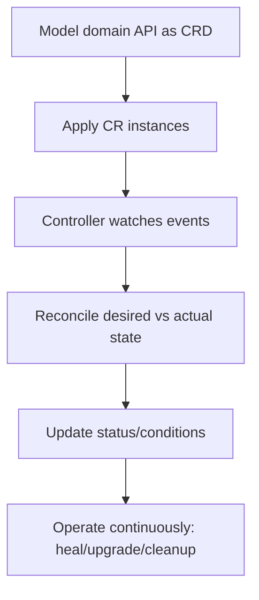
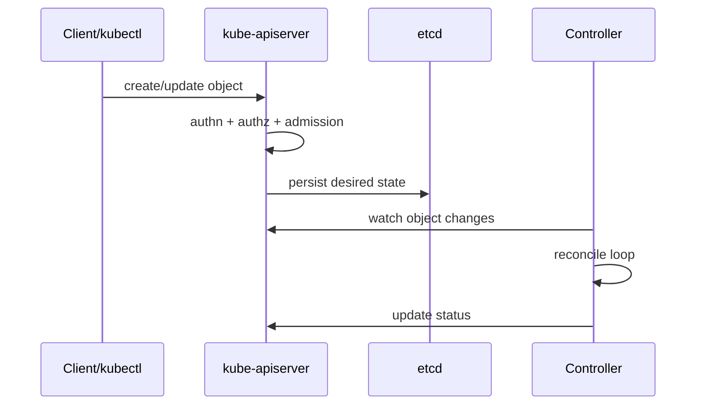
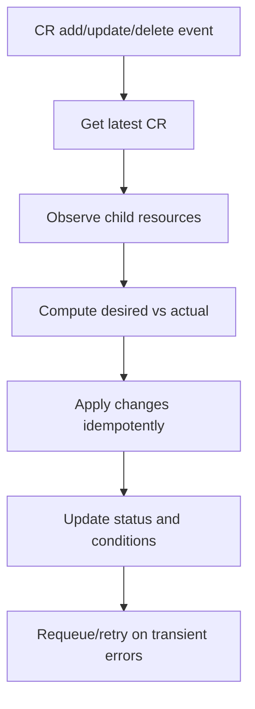
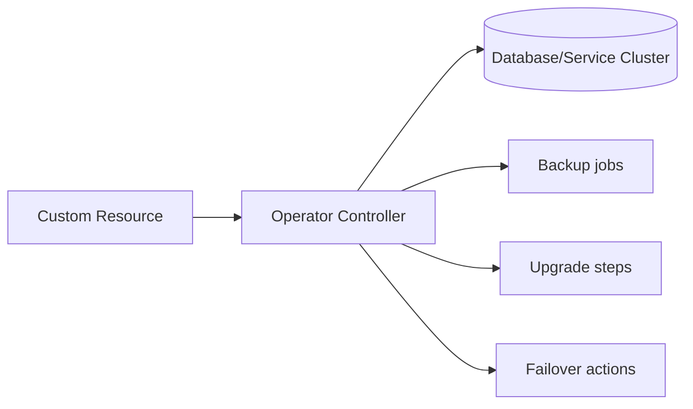
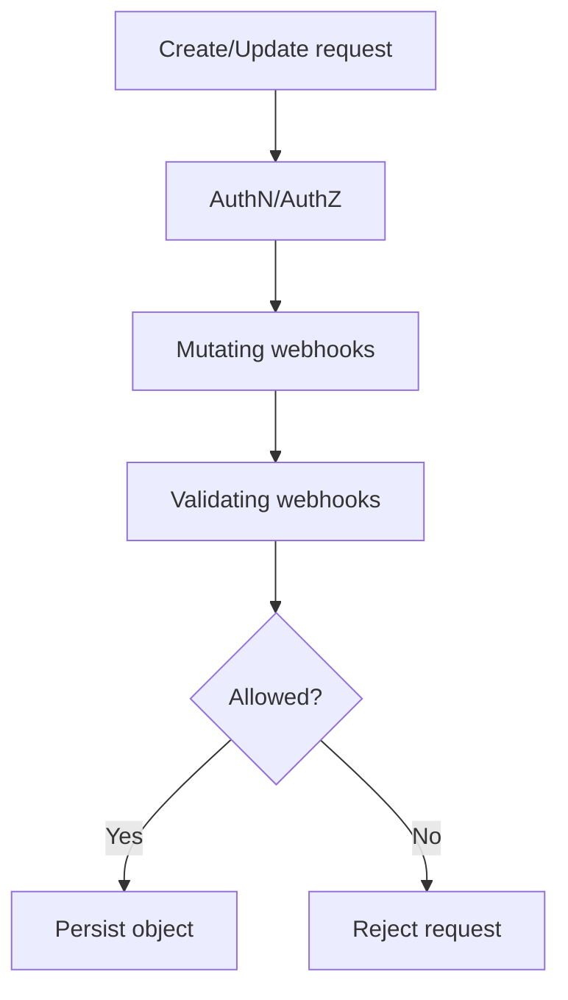
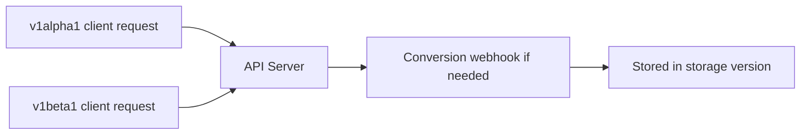
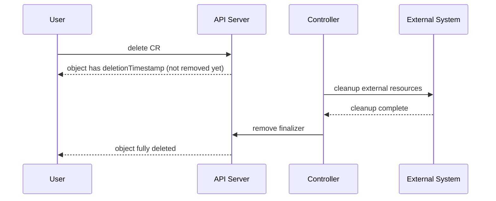

# Kubernetes CRD, API Extension, and Operators (Stage 11)

## What is it?
Kubernetes extensibility is the set of mechanisms that let you add new APIs and automate domain-specific operations on top of Kubernetes.

The most common building blocks are:
- **CRD (CustomResourceDefinition)**: define a new API type
- **Custom Resource (CR)**: an instance of that API type
- **Controller**: reconciliation loop that makes real state match desired state
- **Operator**: controller + operational domain logic
- **Admission webhooks**: validate or mutate objects at create/update time
- **API Aggregation**: register an external API server under Kubernetes API

## What is it used for?
- Modeling platform/business concepts as Kubernetes-native APIs
- Automating lifecycle tasks (backup, failover, upgrades, rotation)
- Enforcing policies and guardrails before objects are persisted
- Building reusable internal platform abstractions

## Why is it important?
For advanced platform engineering, CRDs and controllers let teams move from manual runbooks to reliable automation with declarative control.

## Workflow


---

## Topics Covered
67. Kubernetes API Machinery refresher
68. CRD fundamentals and schema design
69. Building reconciliation logic (controller pattern)
70. Operator pattern (day-2 operations)
71. Admission webhooks (mutating/validating)
72. CRD versioning, conversion, and compatibility
73. API Aggregation vs CRD
74. Production checklist and troubleshooting

---

## 67) Kubernetes API Machinery Refresher

Kubernetes is an API-driven system. Every resource follows this lifecycle:
1. request sent to API server
2. authn/authz/admission applied
3. object persisted in etcd
4. controllers reconcile asynchronously



### Key insight
A CRD adds **new object types** to this same pipeline.

---

## 68) CRD Fundamentals and Schema Design

### CRD vs CR
- **CRD** defines the API shape (`kind`, schema, versions)
- **CR** is user data (an instance of that kind)

### Example CRD (minimal)
```yaml
apiVersion: apiextensions.k8s.io/v1
kind: CustomResourceDefinition
metadata:
  name: caches.platform.example.com
spec:
  group: platform.example.com
  names:
    kind: Cache
    plural: caches
    singular: cache
    shortNames: [cc]
  scope: Namespaced
  versions:
    - name: v1alpha1
      served: true
      storage: true
      schema:
        openAPIV3Schema:
          type: object
          properties:
            spec:
              type: object
              required: [engine, size]
              properties:
                engine:
                  type: string
                  enum: [redis, memcached]
                size:
                  type: string
                  pattern: "^(small|medium|large)$"
            status:
              type: object
              properties:
                phase:
                  type: string
```

### Example CR
```yaml
apiVersion: platform.example.com/v1alpha1
kind: Cache
metadata:
  name: orders-cache
  namespace: app
spec:
  engine: redis
  size: medium
```

### Schema design rules
- keep `spec` for desired configuration
- keep `status` for observed state
- use strong validation (required, enum, pattern)
- avoid unbounded, ambiguous fields

---

## 69) Controller Pattern (Reconciliation)

A controller watches CR events and converges real resources to desired state.

### Reconcile steps
1. read current CR
2. read actual dependent resources
3. compute diff
4. create/update/delete dependencies
5. update `status.conditions`
6. requeue if needed



### Controller best practices
- make reconcile **idempotent**
- separate transient vs terminal errors
- use exponential backoff on retries
- update conditions with clear reasons/messages

---

## 70) Operator Pattern (Day-2 Automation)

An operator is a controller that encodes operational knowledge.

### Typical operator capabilities
- provisioning
- backup/restore
- upgrade orchestration
- failover automation
- certificate rotation hooks



### When to build an operator
- repeated manual runbooks exist
- domain has complex day-2 lifecycle
- human errors create incident risk

---

## 71) Admission Webhooks (Mutating + Validating)

Admission runs before object persistence.

- **Mutating webhook**: patches object defaults
- **Validating webhook**: accepts/rejects object based on policy



### Practical use cases
- force labels/annotations
- block privileged pods
- enforce naming conventions for CRs
- prevent invalid combinations in CR `spec`

---

## 72) CRD Versioning and Conversion

CRDs evolve. Plan versioning from day one.

### Concepts
- `served: true` => version is available to clients
- `storage: true` => canonical etcd storage version
- conversion webhook maps between versions if schemas diverge



### Versioning guidance
- additive changes are safer
- avoid breaking rename/removal without migration path
- document deprecation windows clearly

---

## 73) API Aggregation vs CRD

| Option | Best for | Trade-off |
|---|---|---|
| CRD | Most extension scenarios, fast adoption | Limited custom API behavior compared to full server |
| Aggregated API server | Full custom API semantics | Higher complexity and operational cost |

Choose CRD first unless you truly need full custom API server behavior.

---

## 74) Production Checklist and Troubleshooting

## Production readiness checklist
- CRD schema validation is strict
- controller is idempotent and has retries
- status conditions are meaningful
- RBAC for controller is least privilege
- metrics and alerts exist (reconcile errors, queue depth)
- finalizers are implemented and tested

## Finalizers and safe delete
Use finalizers when external cleanup is required before deletion.



## Common failure patterns

| Symptom | Likely cause | First check |
|---|---|---|
| CR accepted but nothing happens | controller not watching namespace/group | controller logs + watch config |
| Frequent reconcile loops | non-idempotent logic or status churn | compare desired/actual diff logic |
| CR deletion stuck | finalizer cleanup failing | check finalizer and external API errors |
| API rejects CR | schema validation or webhook rule | `kubectl describe` + admission logs |
| Version migration errors | conversion mismatch | conversion webhook + stored version |

## Useful commands
```bash
# CRD and versions
kubectl get crd
kubectl get crd caches.platform.example.com -o yaml

# CR instances
kubectl get caches -A
kubectl describe cache orders-cache -n app

# Events and controller behavior
kubectl get events -A --sort-by=.lastTimestamp
kubectl logs deploy/<controller-deploy> -n <controller-ns>
```

---

## Summary

| Topic | Key takeaway |
|---|---|
| CRD | Adds custom API types to Kubernetes |
| Controller | Implements reconciliation to enforce desired state |
| Operator | Automates day-2 lifecycle operations |
| Admission | Enforces guardrails before persistence |
| Versioning | Prevents API breakage during evolution |
| Aggregation vs CRD | Prefer CRD unless full custom API server is required |
